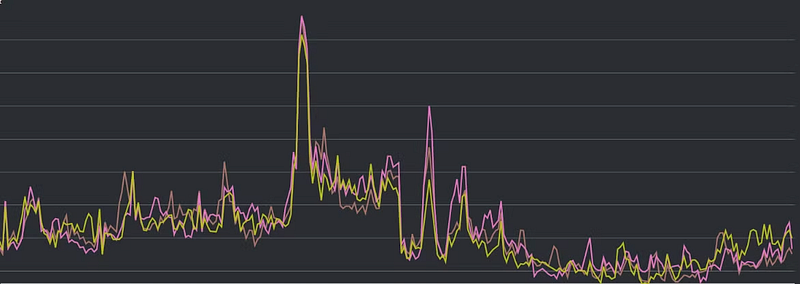
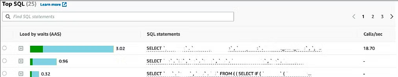
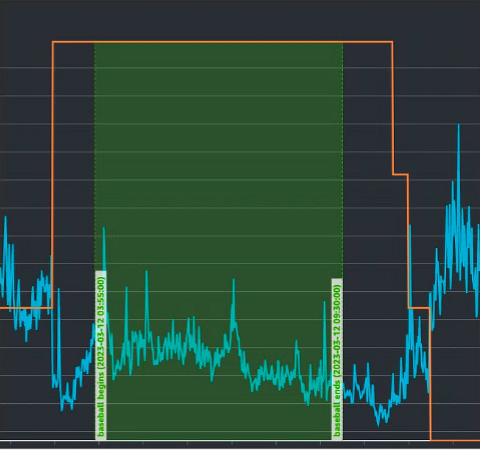
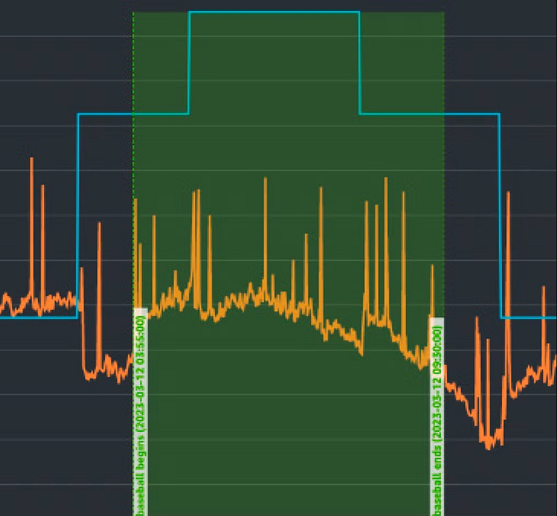

### System Bottleneck

After investigating the root causes of the system bottleneck, the next step is to pinpoint where the service breakdown occurs.

When a user sends a request, it passes through multiple stages, starting with the front-end server, moving through the back-end, and finally reaching the database before a response is returned.

Throughout this process, several services and resources are involved. Typically, a request is not blocked because all services in the chain fail; rather, one specific service is encountering an issue.

Thus, our focus is to identify the “bottleneck” in the system.

The first metric to analyze is the CPU usage of each service at the time of the incident.

In this case, the database server showed signs of overload, with excessive CPU usage. Our initial assumption is that the request is getting stuck at the database, unable to complete.

Refer to Figure 1, which displays the CPU utilization of the database server over time.

While exact figures are not available, the steep peak in the graph clearly indicates CPU utilization reaching 100%.

Moreover, we identified that some time-consuming SQL queries were consuming significant resources on the database server during the incident, with some taking up to 3 seconds per execution. This is shown in Figure 2:

Further investigation revealed that the database auto-scaling process was too slow to handle the surge in traffic.

Whereas a typical backend server (EC2) can be scaled up in about 5 minutes, provisioning a new database server (RDS) takes over 15 minutes — by which time many users may have already left.

It’s understandable that database initialization takes longer, as it involves migrating data to the new instance. Therefore, reducing the time to provision a database server is not a simple solution.

### Short-term Solution

To address the bottleneck, our solution focuses on three main areas:

1. Optimizing database performance, such as improving SQL queries or adding indexes[2].
2. Pre-scaling servers before high-traffic events.
3. Implementing memory caching.

After discussions with the backend engineering team, we decided to prioritize memory caching.

While we work on implementing this caching mechanism, we will pre-scale the servers an hour before popular baseball games to mitigate the delays in scaling.

Customers help us identify “hot” baseball games by sending push notifications to users before these events. These games typically lead to traffic surges. While pre-scaling servers is a short-term solution, there are additional considerations.

Since database servers scale slowly, we increase their capacity to the maximum level before a game begins, ensuring no additional scaling is required during the event. In contrast, backend servers scale more quickly, giving us flexibility to adjust as needed.

Determining the optimal number of servers is particularly challenging. Even when we can predict the number of users, the exact server requirements vary depending on how quickly users join.

To be cautious, we start with a conservative number of servers and adjust based on real-time traffic data.

This process is technically complex and was one of the more time-consuming challenges early on.

The final outcome is shown in Figure 3:

The graph shows the number of database servers (orange line) and CPU utilization (blue line) over time. The rectangular box indicates the duration of the baseball game.

As the graph shows, we double the number of database servers about an hour before the game begins and maintain this increased capacity throughout the event.

Interestingly, we were somewhat conservative in our server estimates, as CPU utilization during the game was actually lower than normal.

Figure 4 illustrates the number of backend machines and their CPU utilization over time.

Although we set a minimum number of backend servers before the game, we were less conservative with backend capacity compared to the database servers.

As a result, the backend scaled gradually during the event. Since backend servers provision faster, this did not affect service availability and allowed us to save costs.

While this short-term strategy seems effective, some further considerations remain, which will be discussed in the next chapter.

[1] SQL Query: A command used to retrieve data from a database. In our case, certain SQL queries were excessively time-consuming, leading to high CPU utilization and preventing the system from handling other requests effectively.

[2] Index: A data structure used in databases to improve query efficiency, similar to a table of contents in a book. Adding indexes can help speed up data retrieval.
