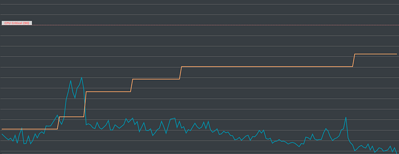
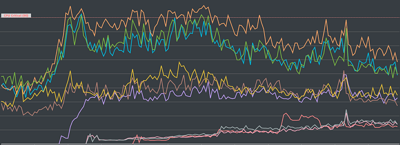
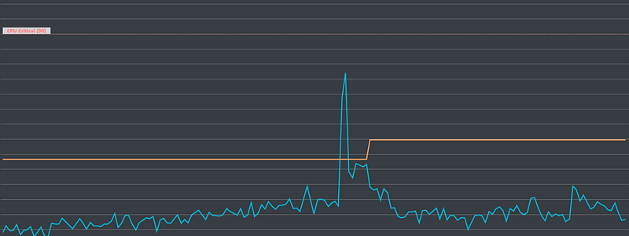
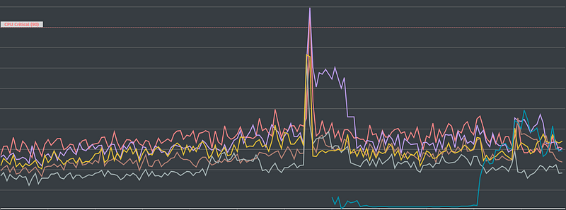
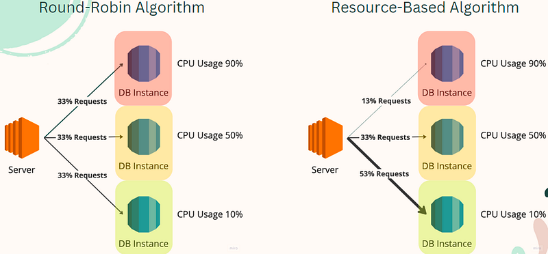

### Additional Challenges

During the process of system tuning, aside from achieving the ultimate tuning objective, there are often additional interesting and shareworthy discoveries. This section aims to share two observations I found noteworthy during the operational maintenance of a baseball event.

#### Load Balancing Challenges

Regarding the first point, please observe the following four graphs:

The X-axis in all graphs represents time. Figures 1 and 2 show the situation without pre-scaling the machines, while Figures 3 and 4 represent the scenario with pre-scaling. Figures 1 and 3 show the number of database servers (yellow line) and the average CPU usage (blue line). Figures 2 and 4 break down the CPU usage of individual database servers.

Figures 1 and 2 depict one baseball game, while Figures 3 and 4 represent another game. Although these are two different games, the number of users and traffic load for both are quite similar.

When comparing Figures 1 and 2, since the server was not pre-scaled, we observe that the yellow line (server count) starts relatively low but eventually grows to about three to four times the initial number. In contrast, Figure 3 shows that with pre-scaling, the yellow line remains relatively stable, only adding an extra server during a peak moment of the game.

Interestingly, even though the number of users wasn’t significantly different, the non-pre-scaled scenario required far more servers by the end.

Why is that?

If we look again at Figures 2 and 4, we can see that with pre-scaling (Figure 4), the CPU usage across servers was quite balanced. However, without pre-scaling, the initial servers were overwhelmed (CPU at 90%, with constant alarms), while the newly added servers were underutilized (CPU at around 40–50%), and the later ones barely worked (CPU at only 10–20%).

Why did this happen? Did our load balancing mechanism fail to distribute traffic evenly across servers? Actually, it’s because our load balancing did distribute traffic evenly, leading to this situation. Refer to Figure 5:

Imagine that without pre-scaling, traffic surges, and the initial servers become overloaded, triggering auto-scaling. Ideally, the load balancing algorithm should direct most traffic to the new servers. However, we used a simple “Round-Robin Algorithm” where requests were distributed evenly regardless of server load. This resulted in overloaded servers staying overloaded while the newer servers stayed idle.

This issue is significant because we not only want to avoid prolonged high CPU usage but also minimize server costs by using the fewest number of servers, as database servers are expensive. Initially, we assumed pre-scaling would be costlier, but as observed, not pre-scaling led to more servers being added and higher costs in the end.

Currently, since we are using AWS managed services, we cannot customize the load balancing algorithm. Therefore, the solution before implementing a caching mechanism is to pre-scale servers for popular games.

A senior colleague mentioned that complex algorithms often lead to unexpected issues. Although simple algorithms come with challenges, based on past experience, we might still opt for simpler approaches in the end.

By the way, I believe one of the key skills for an SRE is to be able to interpret graphs and tell a story. Like a storyteller, weaving events into a coherent narrative is a vital skill for an SRE.

#### Negotiation and Communication Challenges

Now that we’ve discussed the technical findings, let’s move on to some negotiation processes with the customer.

In the previous section, did you find something odd? Even though the bottleneck was at the database servers, we ended up pre-scaling the backend servers instead.

This decision, like most practical situations, was influenced by non-technical factors. The main issue was that the event stemmed from around 30 minutes of system downtime, which led to a decrease in the customer’s trust in our service. As a result, our technical recommendations were met with more conservative discussions.

For example, after evaluation, we concluded that only the database servers needed pre-scaling. However, to regain the customer’s trust, we also had to include backend servers. Additionally, the negotiated number of pre-scaled database servers often exceeded the initially calculated amount, leading to extra costs.

However, after several baseball games passed without incidents, customer trust was slowly rebuilt, and we were eventually able to pre-scale servers more accurately.

### Author’s Thoughts

The baseball event was one of the first major and important operations incidents I encountered. It was a high-stress situation because it stemmed from a major P0 event, and the baseball games were long-lasting, high-profile activities that the customer cared deeply about.

From this incident, I learned many critical SRE skills, such as analysis (interpreting graphs and telling stories) and accurately calculating the necessary number of machines under high traffic.

Additionally, I realized that SRE is a role that requires a lot of communication, and sometimes decisions ignore purely technical considerations. Perhaps, this is what makes SRE so valuable!
