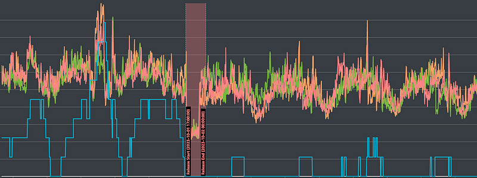

### Long-term Solution

After the short-term solution had been implemented for several months, the cache mechanism, which serves as the long-term solution, was finally launched.

However, the nature of various maintenance and operational tasks has also changed. Next, we will introduce the relevant details.

#### Data Observation

From the perspective of database data, the situation of traffic distribution can be described as excellent. Please refer to Figure 1:

The horizontal axis represents time (approximately one week), while the vertical axis represents the number of database servers (blue line) and CPU usage (other colors).

The red area in the middle marks the time when we deployed the new version.

As shown, the difference in the number of database servers before and after the deployment is quite significant, with the number of servers required during peak traffic times differing by as much as five to six times. However, CPU usage did not vary significantly, proving that our traffic switching had a substantial impact.

Additionally, after the new version was launched, there was a momentary spike in CPU usage accompanied by an increase in the number of database servers compared to other times.

After reviewing the data, we found that traffic surged to levels close to that of a championship baseball game. However, since the cache effectively handled most of the traffic, the number of required database servers remained low, and no unavailability occurred despite the CPU spike.

In other words, we successfully improved system performance and availability through the cache mechanism, thanks in large part to the support of the backend engineers.

#### Negotiating with the Client

While the improvements are clear, convincing the client is a separate task.

After discussions with the product manager and the client, we decided to test the current system’s performance during the next three baseball games.

For the first game, we plan to provision a more conservative number of servers (more than usual) to observe system performance.

If successful, we will try adding only a few servers for the second game to observe performance.

If that is also successful, we will avoid pre-provisioning entirely for the third game to confirm that the system can handle the load.

Even without the need to persuade the client, conducting several experiments to verify the results is a relatively prudent approach.

After all, the ultimate goal of the cache mechanism is to no longer require pre-provisioning of databases, and it would be great to confirm this goal.

Fortunately, our new system successfully handled the baseball games, so this long-term solution can be considered officially complete.

In the next chapter, we will discuss the problems and challenges we encountered during the implementation of the cache mechanism, especially the configurations of out ElastiCache servers.
