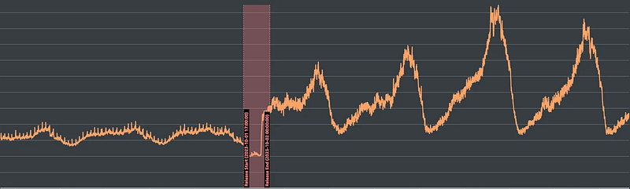
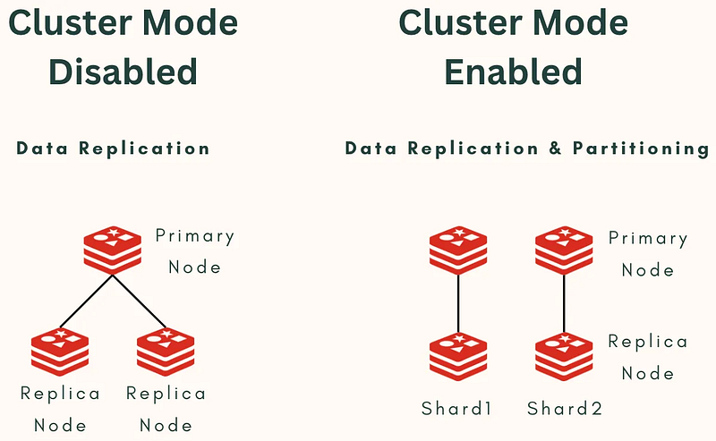
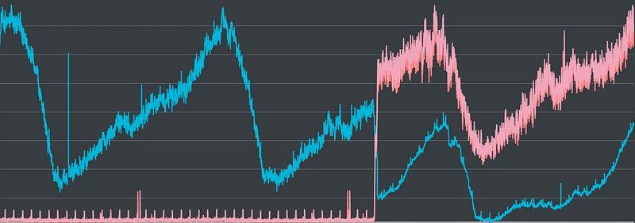

### ElastiCache Challenges — Cluster Mode

While the long-term solution did effectively resolve our issues, we encountered many noteworthy incidents throughout the process.

For instance, on the very night after we finalized our scaling plan, we received an alert about excessively high CPU usage on our cache server (Amazon ElastiCache for Redis). This alert persisted for almost the entire night and recurred on subsequent weeknights (even without baseball games).

Although our services remained accessible during these alerts, it seemed that after redirecting traffic, the cache server might become the next victim of excessive traffic, following the database server. This is illustrated in Figure 1:

After the new version’s release, CPU usage not only increased significantly but also reached dangerous levels during peak traffic.

#### Overview of Amazon ElastiCache for Redis

“Amazon ElastiCache for Redis” is the caching service we utilize. Its smallest unit is a “Node” or a “Shard.” The former applies in general cases, while the latter is the smallest unit when “Cluster Mode” is enabled.

Several Nodes or Shards form a Cluster (Replication Group), and we usually connect to a Cluster.

In other words, the term “Cluster” has two meanings here.

One refers to a “Cluster (Replication Group)” composed of several Nodes or Shards, and the other refers to “Cluster Mode,” which determines whether sharding functionality is enabled.

This can be quite confusing, as shown in Figure 2:

To avoid confusion, we will use “Replication Group” and “Node Group” to refer to “a unit composed of several Nodes or Shards,” while “Cluster Mode” describes “whether sharding is enabled.”

#### The Predicament of Connecting to the Wrong Target

During the initial investigation, since our existing goal was to have the cache server handle most of the traffic, we initially considered upgrading the cache server’s hardware.

However, throughout the investigation, our backend engineers discovered that the intended traffic recipient seemed different from what they expected. We were connected to the wrong Replication Group. We intended to connect to the group with Cluster Mode enabled, but we were connected to another group without it.

In reality, the endpoint connected by the backend program was managed by Route53 and redirected to the ElastiCache endpoint via “CNAME.”

However, the CNAME redirection target was the old Replication Group. This misconnection seemed to have persisted for so long that we couldn’t find who initially configured it or the reason behind it. We only discovered it because of the alert.

Although simply modifying the Route53 settings was relatively straightforward, and we resolved this issue within a few days, one of the reasons for enabling Cluster Mode was to increase the cache server’s availability after sharding.

Therefore, correcting this setting should improve the frequent alerts to some extent, as shown in Figure 3:

The blue line represents the Replication Group without Cluster Mode enabled, while the red lines represent the two Node Groups with Cluster Mode enabled (showing two lines because sharding is set to 2).

In the next chapter, we will discuss the difference between CPU and EngineCPU, which takes an important tole in monitoring the ElastiCache service.
