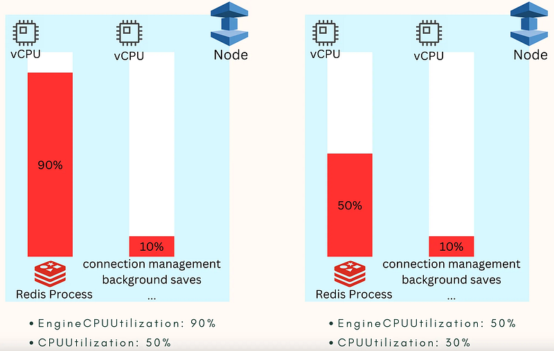
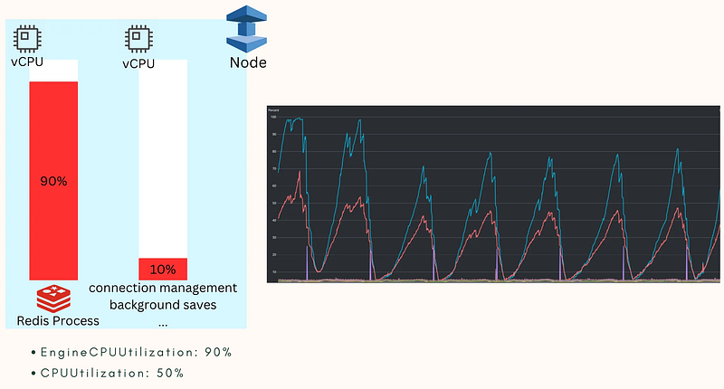
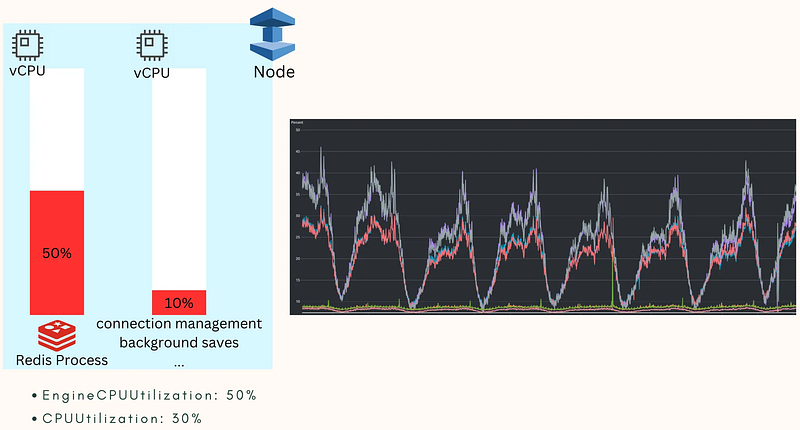

### CPU and EngineCPU

Apart from mismatching the target, our backend engineering supervisor impressively identified issues with the monitoring target.

It appeared that the alerts being triggered had no direct correlation with the service’s availability, leading him to question whether we were monitoring the wrong metrics.

This brought to light two different types of CPUs: the “general CPU” and the “EngineCPU.”

To clarify the difference between these two types of CPUs, one must first understand Redis’s **Single Threaded Model**.

This design essentially means that only one process in the system handles requests at a time.

The key point is that this design results in **only one vCPU being utilized at a time**.

As shown in **Figure 1**, the left side represents the system under full load. While the machine in use has two vCPUs available, the **Redis process** only utilizes one vCPU at a time.

Consequently, even though the vCPU used by the Redis process is at full load (around 90%), the second vCPU remains lightly utilized (around 10%, handling routine system tasks).

This leads to an overall **CPU utilization** of only about 50%.

Since observing the general CPU cannot accurately reflect Redis’s performance, **EngineCPU** directly measures the vCPU utilization by the Redis process, providing a clearer view of Redis’s behavior.

The right side of **Figure 1** shows Redis in a normal operating state (with an EngineCPU utilization of 50%), where the overall CPU utilization is approximately 30%.

These observations are consistent with Redis’s **Single Threaded Model** and can be confirmed through real-world monitoring data, as shown in **Figures 2 and 3**:

In Figure 2, the blue line represents **EngineCPUUtilization**, while the red line represents **CPUUtilization**. When the EngineCPU utilization approaches 100%, the CPU utilization remains around 50%, consistent with expectations.

In Figure 3, the gray and purple lines represent **EngineCPUUtilization**, while the red and blue lines represent **CPUUtilization** (with two lines due to two shards).

When EngineCPU utilization is at 50%, CPU utilization hovers around 30%, again meeting expectations.

### Setting Monitoring Criteria

With these observations aligning with expectations, we can set related monitoring items. For example:

• If **EngineCPUUtilization** exceeds 90%, significant delays or database traffic (that should have been handled by the cache) may occur. Alerts should be configured at this threshold.

• Correspondingly, the **CPUUtilization** threshold might be set around 50%.

### Future Prospects

Ideally, we hope ElastiCache could achieve automatic scaling like RDS.

According to the official documentation, this requires **Redis Engine 6.0 or higher**, while we are currently using version 4.x, which lacks such features.

However, this provides a potential solution. When encountering performance bottlenecks, instead of merely upgrading the machine tier or adding shards, upgrading the engine version and enabling auto-scaling could become a viable option.

### Takeaways for SRE

From ElastiCache monitoring adjustments, it’s clear that SREs need a certain level of understanding about the service itself to establish proper monitoring standards.

While this may seem daunting, we learned these principles by studying documentation when facing related incidents.

Therefore, there’s no need to master all the details upfront. Simply maintaining a willingness and passion for diving deeper when needed is sufficient.
