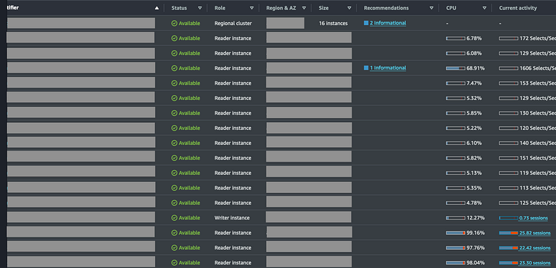
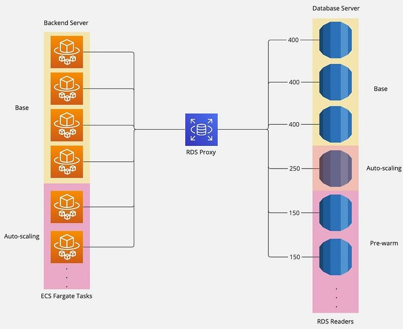

### Second Game

#### System Performance in the New Baseball Season

Our system transitioned into the new baseball season seamlessly after implementing a long-term solution, avoiding the need to scale up additional servers throughout the season.

This significantly reduced the workload on both SREs and backend engineers.

However, this period of stability came to an abrupt end with the start of the new season. Similar alarms and incidents recurred, this time seemingly more severe than before.

#### Incident Summary

Just like during the first game, one afternoon, we were suddenly inundated with numerous P0 alarms, including a Pingdom DOWN alert indicating the platform was inaccessible.

Simultaneously, our monitoring team reported that website access speed had become exceptionally slow, or even completely unavailable.

It felt like history repeating itself, down to the same on-call engineer responding.

This time, however, prior experience allowed us to identify the database as the likely root cause more quickly. Additionally, since our backend servers had already migrated from Amazon EC2 to AWS ECS Fargate, there was no immediate need to scale up server instances.

The immediate response involved having backend engineers handle resource-heavy queries directly within the database.

#### Initial Cause Analysis

Based on prior experience, the initial analysis suggested a scenario similar to the previous one. One key factor was the natural increase in user activity over time, which had pushed the system close to its performance limits.

Moreover, routine database maintenance tasks executed periodically by the backend system further strained the system during peak times. Specifically, these tasks involved issuing Data Definition Language (DDL) commands to the database’s “Writer” instance.

In AWS RDS, such commands require exclusive access to the table, causing all other “Reader” queries on the same table to be canceled or disconnected.

Affected users received error messages on their clients, often prompting them to reload the page. This reloading sent additional requests to the system, compounding the issue.

Similar to the first game, new users generate more requests than active users, leading to system overload and eventual collapse.

#### Knowledge Notes

- **Writer & Reader:** In distributed systems, databases are often architected with a single “Writer” for write operations and multiple “Readers” for read operations. This approach is optimized for scenarios with a high read-to-write ratio.
- **Data Definition Language (DDL):** Commands for defining or modifying database structures, such as creating, altering, or dropping tables.

### Recurring System Crashes

Despite identifying the issue as an excessive number of read requests, and deploying a hotfix to mitigate the impact of routine commands on database performance, the problem persisted during subsequent games.

Even after scaling the AWS RDS (Aurora) instance count to the maximum (15 readers), P0 incidents continued to occur.

The repeated P0 incidents escalated the situation, leading to daily meetings with the client and heightened attention from company leadership. The pressure was immense.

#### Secondary Cause Analysis

As we scaled the number of instances to the maximum and still encountered P0 incidents, we observed a perplexing phenomenon.

Similar to the “Load Balancing Challenge” mentioned in the first game, the requests were disproportionately concentrated on a small subset of database servers.

While these servers were overwhelmed, the majority of other servers remained underutilized.

As illustrated in Figure 1, among the 15 reader instances (excluding the writer), only four showed significant activity, including the three initially active instances and the one that had been scaled up hours earlier.

The remaining instances, which had been pre-provisioned and confirmed to be ready for traffic before the game, maintained CPU usage rates of only 5–8%, effectively remaining idle.

Another phenomenon shows that the connection distribution was similarly uneven, that the three initially active instances sustained ~400 connections each, the auto-scaled instances handled ~250 connections each, and the manually scaled instances handled only ~150 connections each, as illustrated in Figure 2.

### Root Cause: Connection Imbalance

While the surge in connections was a factor, the inability to effectively distribute these connections across instances was the primary issue.

After consulting AWS, we discovered that “RDS Proxy,” despite its benefits, lacked load balancing functionality at the time of the incident.

### Post-Mortem Thoughts

The absence of load balancing in RDS Proxy shocked many within the company.

Although the service had been implemented years earlier by a now-departed colleague, this incident underscored the importance of thoroughly reviewing documentation rather than relying on assumptions based on service names.

This was a hard but valuable lesson.

In the next article, we will explore solutions to these issues.
