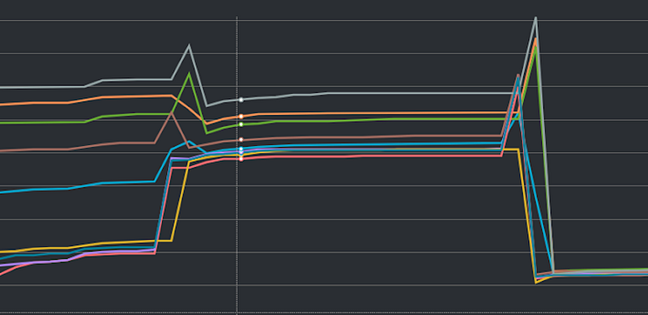
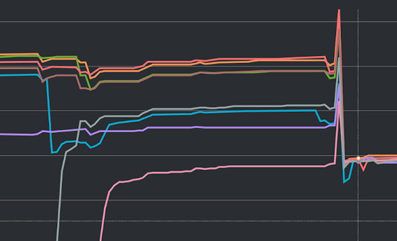

### **Short-term Solution**

In the short term, the solution inevitably involves starting up additional machines before the game begins.

However, because this time there is also an issue with uneven connections, an extra measure to “equalize the connections” is required.

There are at least two approaches to “equalizing the connections”: one is to directly increase the number of online API servers, and the other is to redeploy the online API servers.

The latter forces all connections to be interrupted, which is clearly more effective than the former.

However, because it is relatively more difficult to automate, the former was initially chosen to avoid the predicament of having to handle things manually over the weekend.

In previous experiments, we found that the effect of a single redeployment was limited; in fact, only after a second redeployment did we see a noticeable improvement.

Figure 1 shows the variation in the number of RDS connections. It can be observed that during both redeployments there was a significant increase in the connection count, indicating that connections were reestablished quickly and tended to stabilize thereafter.

However, after the first redeployment the connections still showed discrepancies.

It was only after the second redeployment that they became nearly identical — a phenomenon that has been repeatedly observed. The underlying causal relationship is truly perplexing.

Although we never fully understood all the technical details, we believe that it may be because a newly provisioned RDS machine actually takes longer to be fully ready.

Although the RDS console usually indicates that a new machine is accessible about fifteen minutes after startup, we suspect that in reality it takes longer.

Therefore, since the second redeployment in previous cases occurred around forty minutes after startup, we decided to adopt that timing for our next experiment.

Figure 2 illustrates the state of the RDS connections. A redeployment conducted after a 40‑minute interval produced very significant results, confirming our earlier hypothesis.

#### **Post-Mortem Thoughts**

Apart from the redeployment, the other preparatory tasks were similar to those in the first game.

Calculating the required number of machines is, of course, a challenging task, but an equally arduous one is the negotiation process with the client.

Since the client is primarily concerned with the stability of the system, they will demand that we start up as many new machines as possible.

However, we cannot continue adding machines indefinitely while ignoring system and manpower costs.

Eventually, we must try to reduce the number of additional machines to approach the system’s performance limits, even though this inevitably carries a certain degree of risk.

Although our calculations confirm that the risk is very low, convincing clients — who have already lost some trust in our system — remains a major challenge.

### **Long-term Solution**

The long-term solution is divided into two parts.

One is the “backend code improvements,” which conceptually share some similarities with the details mentioned during the first game.

The other is the “Promotion Plan,” which we propose as a permanent resolution to this problem.

#### **Backend Improvements**

The backend improvements directly address the issues we have encountered.

As with the first game, we attempted to use caching to offload some of the requests that put an especially heavy burden on the database.

In practice, this improvement produced similarly significant results — so much so that after the improvement was deployed, we no longer needed to add extra machines.

Another measure is to implement a function on the backend that periodically resets connections.

Although with the caching mechanism in place we temporarily won’t need to execute actions like “adding machines” or “resetting connections”, in the long run this functionality remains essential and can effectively improve the typical connection issues that require adding machines.

#### **Promotion Plan**

At this point, the reader might have noticed an unavoidable cycle.

After an incident occurs, we identify a system bottleneck and then implement a series of improvements to resolve the issue; as user numbers gradually increase, another incident reveals the next bottleneck, necessitating yet another round of improvements.

This cycle in itself is not necessarily a problem to be solved.

What we truly care about is that the occurrence of incidents affects both the stability of the service and the client’s trust in our system, and that the manual process of adding machines between the incident and the implementation of improvements is very labor-intensive.

By treating these regularly occurring baseball games as events that require the addition of extra machines, we have developed the necessary tools and asked the client to provide an expected headcount.

We then use that number in conjunction with our tools to add machines at a specified time — this is the solution we propose.

Compared to the previous method of manually executing commands to add machines, this approach has several advantages.

First, once the relevant tools are built, executing the commands becomes much simpler.

Second, we can pre-calculate the ratio between the number of users and the number of machines and embed this formula directly into the tool, eliminating the need to manually compute the exact number of machines each time.

Finally, having the client provide their expected headcount can effectively reduce the difficulties and errors in our calculations.

Since the service is owned by the client, they can often provide a more accurate estimate than we can.

If possible, we also hope to turn this tool into a service that can be delivered to the client.

In the future, the client would then be able to perform promotions by operating the tool themselves, thereby reducing the need for back-and-forth communication.

#### **Post-Mortem Thoughts**

The baseball game is undoubtedly one of the most classic cases for SREs.

First, it represents a typical high-traffic challenge faced by SREs.

Second, due to the exceptionally high traffic, the observable phenomena are relatively rare.

Third, the discussions and pressures from clients and product managers are an indispensable part of the process.

I once heard a senior remark that the essence of any system is simply CRUD — the only difference being the scale. Perhaps this example illustrates that point.
