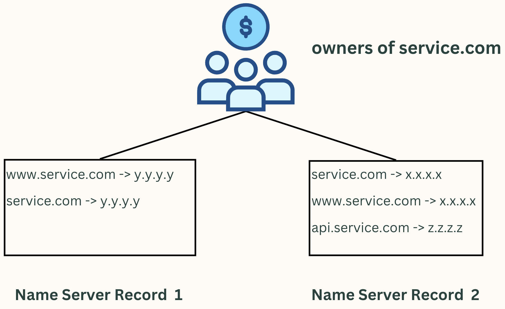
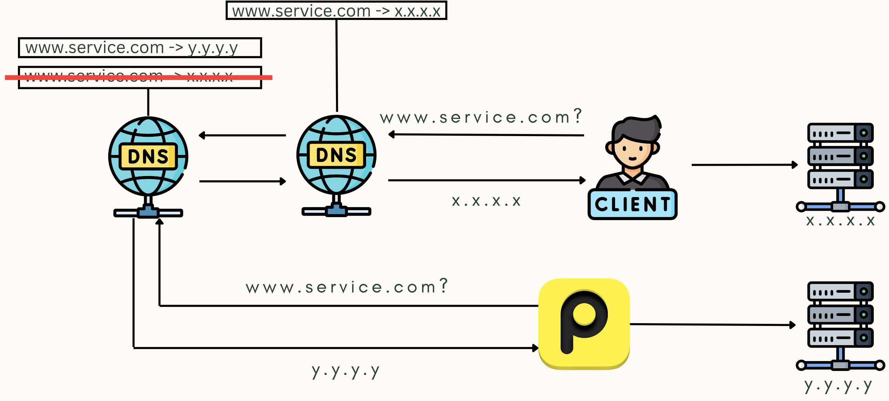

")

[Part 1: Incident Alarm](../Part1/Incident_Alarm.md)

# DNS Primer

Before explaining the root cause, we need a basic understanding of DNS.
Using Google as an example, when a user types "www.google.com" into a browser, the client sends a DNS request to the nearest DNS server.
If that server has the record, it returns the IP address (for example, 142.251.46.174), and the browser then sends the actual HTTP request to that IP.

If the nearest DNS server does not have the record, it asks higher-level DNS servers until it finds one that does.

An important detail: all DNS servers should eventually share the same configuration, but updates propagate from higher-level servers to others over time.
Right after a change, some users may still receive the old IP address while others see the new one.
Keep this in mind; it is critical to this incident.

DNS-related services include domain registration and DNS routing configuration.
In AWS, the relevant service is Route 53, which this project used.
Other well-known providers include GoDaddy, and many CDN vendors also offer DNS services.

After buying a domain, you can set DNS routing rules.
For example, Google owns "google.com" and sets "www.google.com" to map to a specific IP address.
They can also set other records like "api.google.com".

However, anyone can create DNS routing rules anywhere.
I could open my Route 53 console and create a rule that points "www.google.com" to "123.123.123.123".
That would not affect Google's real service.
This is where the Name Server (NS) record comes in.

# Name Server Records

A domain can have multiple DNS providers that each host their own routing rules.
The domain owner decides which provider is authoritative by setting NS records at the domain registrar.
If the NS record points to "Name Server 1," then those DNS rules are used.
If it points to "Name Server 2," then a different set of rules takes effect.

Author's aside: I only learned this properly after the incident.
One benefit of P0 incidents is that they force you to fill in painful knowledge gaps.

# Root Cause

In this project, the customer bought the domain and delegated DNS management to us by pointing their NS records to our DNS service.
The root cause was simple: the NS record was changed.

Once the NS record was modified, the routing rules changed from "www.service.com" -> "x.x.x.x" to "www.service.com" -> "y.y.y.y".
The new server did not host the original service, so Pingdom received unexpected responses and triggered DOWN alerts.
Because all DNS records were affected by the NS change, every related Pingdom alert fired at once.

But why could we still access the site at the time of the alert?
Remember DNS propagation: the nearest DNS servers still had the old configuration.
Some users (including us) were served the old IP, while others were already seeing the new one.

In other words, within 24 hours we would expect more and more users to lose access.
In fact, roughly four hours after the alert, users began reporting that they could not reach the site.

Author's aside: In hindsight, the fix was straightforward: ask the customer to revert the NS record.
But finding the cause was not easy.
Like debugging, identifying the root cause in a P0 incident takes experience that is hard to learn in advance.
That is one reason SRE work is so valuable.

# Next

In Part 3, we will walk through the response steps and the communication challenges that followed.

[Continue to Part 3](../Part3/Response_and_Communication.md)
