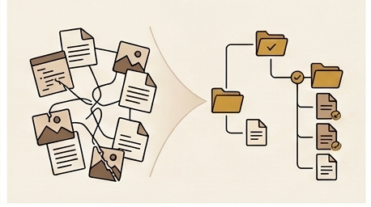

Part 1 covered the methodology — why I built from scratch, why AWS, and how AI pairing worked in practice. This part picks up where the platform had a working deploy pipeline but no content. The next problem was getting my existing articles off Medium and into a self-hosted Markdown pipeline, then figuring out how to organize them once they arrived.

## The Migration Goal

The motivation for leaving Medium was straightforward: I wanted full control over my content. Medium's editor is fine for writing, but the moment you want to do anything beyond publishing a single article — custom series navigation, bilingual support, tag-based filtering, a build pipeline that generates JSON and RSS artifacts — you are working against the platform rather than with it. Every feature I wanted for the new site required owning the source files.

The scope was not trivial. I had dozens of articles on Medium, some in English, some in Mandarin, and a few in both languages. Several articles belonged to multi-part series — an 8-chapter analysis of Attack on Titan, a multi-part DevOps SRE diary on maintenance mode, a set of P0 incident write-ups. Each of these had its own organizational needs: series ordering, shared cover images, language-specific slugs. Moving them meant not just converting files but designing a content model that could handle all of these cases from the start.

The end state I was aiming for: every article lives as a Markdown file with YAML frontmatter, stored in a semantic folder structure under `content/articles/`. A build script walks the tree, parses the frontmatter, resolves series relationships, and generates the JSON index and RSS feeds that the site consumes. No database, no CMS, no runtime dependencies — just files, a Python script, and a deploy pipeline.

## The Medium Export Pipeline

Medium gives you an export of your data, but what you get is HTML files — not Markdown. The first step was converting those HTML files into Markdown, which sounds simple until you actually do it. The HTML-to-Markdown converters available online get you about 80% of the way there. The remaining 20% is where the real work lives.

The problems I encountered were consistent across nearly every article. Image embeds pointed to Medium's CDN URLs, which are long, opaque, and not guaranteed to be permanent. Filenames in the export had special characters and spaces that needed normalization for a filesystem-friendly layout. The Markdown output from the converter had malformed links — missing closing parentheses, broken reference-style links, formatting that looked right in a quick scan but broke when parsed by a strict Markdown renderer.

Timestamp extraction was another friction point. Medium's export includes publication dates, but they are buried in the HTML metadata rather than presented cleanly. Extracting them reliably required parsing the HTML before converting to Markdown, because the converter discarded that metadata. I ended up writing extraction logic that pulled dates from the export HTML and injected them into the YAML frontmatter of the converted Markdown files.

The cleanup was manual and tedious. Every article needed a pass to fix broken formatting, verify that links still worked, and confirm that the frontmatter was complete. There was no shortcut here — the converter got me a draft, and I edited each one into a publishable file. For dozens of articles, this took days, not hours.

## Image Localization

The image problem deserved its own solution. Every Medium article that included images had embeds pointing to `miro.medium.com` CDN URLs. These URLs work today, but Medium has changed their CDN paths before, and relying on a third-party CDN for images on a self-hosted site means your articles can break silently. One day the images load; the next day they return 404s, and you do not notice until a reader tells you.

The fix was `localize_medium_images.py`, a script that scans Markdown files for Medium CDN image URLs, downloads each image, stores it beside the Markdown file in the same directory, and rewrites the embed to a local relative path like `./image-01.jpeg`. The script handles content-type detection to get the right file extension, deduplicates downloads when the same image appears in multiple places, and generates clean filenames from the image alt text or a sequential numbering scheme.

Running the script in dry-run mode first was essential — it showed me exactly which URLs it would download and what the rewritten embeds would look like, without touching any files. The `--write` flag applied the changes for real. After running it across the entire content tree, every image was local, every embed pointed to a relative path, and the articles no longer had any dependency on Medium's infrastructure.

This was one of those investments that felt like overkill at the time but paid off immediately. The moment the images were local, I could see them in my editor, version-control them alongside the Markdown, and know that a deploy would include everything the article needed without any external fetches.

## The Bilingual Challenge

Some of my articles exist in both English and Mandarin. This is not a translation layer — the two versions are often written independently, with different phrasing, different cultural references, and sometimes different structure. The content model needed to treat them as siblings of the same work, not as a primary and a translation.

The key design decisions were: both language versions share the same `id` in frontmatter, so the build script knows they are the same article in different languages. Each version has its own `lang` field (`en` or `zh`) and can have its own `slug` if the URL needs to differ. The site renders language toggle links automatically based on the presence of sibling files.

Images added another layer of complexity. When both language versions use the exact same image — same binary, same dimensions — storing it twice is wasteful and creates a maintenance burden. But when the images differ between languages (a screenshot with English UI versus Mandarin UI, for example), each version needs its own copy. The folder structure handles this with a `Shared/` directory at the work level for common assets, and language-specific directories (`English/`, `Mandarin/`) when the binaries differ.

The `dedupe_bilingual_images.py` script automates the deduplication. It walks every work directory that has both language variants, computes SHA-256 hashes of all images, identifies exact duplicates, moves them into the `Shared/` folder, and rewrites the Markdown references in both language files to point to the shared location. Running it with `--write --verify` applies the moves and then checks that every local image reference in every Markdown file still resolves to an existing file. The verify step caught several edge cases where the rewrite logic needed adjustment — images referenced with slightly different relative paths, or files that had already been partially deduplicated in an earlier manual pass.

## The Initial Taxonomy

The first attempt at organizing articles was simple: three main categories (`technical`, `review`, `other`) plus a flat list of tags. Each article got a `category` field in frontmatter and a `tags` array. The build script used these to generate the index, and the site's filtering UI let readers pick a category or a tag to narrow the list.

This seemed sufficient when I had a handful of articles. Technical articles about EKS, maintenance mode, and DNS all lived under `technical`. Reviews of anime, movies, books, and games all lived under `review`. Personal essays and civic writing lived under `other`. Tags like `aws`, `kubernetes`, `anime`, and `movie` provided the secondary filtering layer.

The problem was not visible at first. With ten or fifteen articles, the flat list was manageable. But as I migrated more content — the full Attack on Titan series (eight chapters), the maintenance mode diary (multiple parts), the P0 incident write-ups, the movie and game reviews — the list grew long and the categories stopped being useful. A reader looking for my DevOps incident write-ups had to scroll past anime reviews and philosophy exam notes if they were browsing by recency. Filtering by the `technical` tag returned everything from EKS deep dives to DNS debugging to this very series, with no way to distinguish between them.

## The Taxonomy That Did Not Scale

The core issue was that flat categories plus tags could not express the relationships that mattered to readers. There were no subcategories, so `technical` was a single bucket containing operation diaries, deep dives, and standalone articles that had nothing in common except being about technology. The `review` category was the same — anime, movies, books, and games all in one list, differentiated only by tags.

The tag list itself grew long and undifferentiated. Tags like `anime`, `manga`, `movie`, `book`, and `game` were doing the work that subcategories should have been doing. Series articles were scattered across the flat list with no grouping beyond the `series_id` in frontmatter, which the filtering UI did not surface. A reader who found one part of a series had no easy way to see the other parts without knowing the series existed and searching for it.

For review articles specifically, the problem was acute. I had eight chapters on Attack on Titan, multiple reviews of movies, a book review, and game reviews. A reader interested in anime had to sift through movie and game reviews to find the anime content, because the only distinction was a tag. The review category needed medium-specific grouping — anime and manga together, movies separate, books separate, games separate — and flat tags could not provide that structure.

## The Pivot

The solution was adding subcategories and letting the folder structure itself become the taxonomy. Instead of a flat `technical/` directory, the content tree gained semantic subdirectories: `technical/Operation_Diaries/` for chronological project diaries, `technical/Operation_Deep_Dive/` for standalone deep dives into specific topics. Instead of a flat `reviews/` directory, the tree gained medium-specific folders: `reviews/Anime_Manga/`, `reviews/Movie/`, `reviews/Book/`, `reviews/Game/`.

Series articles got their own work directories with `Part1/`, `Part2/`, and so on as subdirectories. The Attack on Titan analysis lives under `reviews/Anime_Manga/Attack_on_Titan/` with eight part folders inside. The maintenance mode diary lives under `technical/Operation_Diaries/Building_A_Reliable_Maintenance_Mode/`. This series — the one you are reading — lives under `technical/Operation_Diaries/Solo_Platform_Engineering_Vibe_Coding_Diary/`.

The folder structure provides the human-readable taxonomy: you can browse the content tree and understand the organization without reading any metadata. The frontmatter provides the machine-readable layer: `category`, `tags`, `series_id`, `series_title`, and `part_number` give the build script everything it needs to generate indexes, series navigation, and filtered views. The two layers reinforce each other — the folder tells you where the article belongs conceptually, and the frontmatter tells the build system how to process it.

Bilingual articles fit naturally into this structure. A work directory like `Let_Myself_Off/` contains `English/` and `Mandarin/` subdirectories (or simply `en.md` and `zh.md` at the work level for simpler cases), with a `Shared/` folder for common images. The build script discovers both language versions by walking the tree and groups them by their shared `id`.

## How AI Plan Mode Helped

The taxonomy decision was not obvious, and I did not arrive at the final structure in one step. This was where AI plan mode — asking the AI to break a problem into discrete decisions and enumerate the tradeoffs for each — proved genuinely useful.

The first question was flat versus nested. A flat structure is simpler to maintain and harder to get wrong, but it does not scale when the content grows. A nested structure requires more upfront design but makes browsing intuitive. The AI laid out the tradeoffs clearly: flat works for small collections, nested works for large ones, and the migration cost of going from flat to nested later is higher than starting nested.

The second question was folder-based taxonomy versus metadata-only taxonomy. Should the folder path carry semantic meaning, or should every article live in a flat directory with all organization handled by frontmatter fields? The AI enumerated the options: folder-based is easier to browse in a file manager and in version control, metadata-only is more flexible for articles that belong to multiple categories. I chose folder-based for the primary taxonomy (category and subcategory) and metadata for the secondary layer (tags and series membership), because the primary taxonomy is stable — an anime review does not become a technical article — while tags and series can evolve.

The third question was how to handle bilingual variants. Options included: separate directories per language at the work level, language suffixes on filenames (`en.md`, `zh.md`), or a completely separate content tree per language. The AI helped me see that language suffixes at the file level, combined with a `Shared/` folder for common assets, gave the best balance of simplicity and deduplication. The build script could discover both variants by filename convention without needing a separate configuration file.

The fourth question was how to handle series that span categories — or more precisely, confirming that they do not. Every series I had fit cleanly within a single subcategory. The AI pointed out that if a series ever did span categories, the folder structure would need a different approach (symlinks, or metadata-only series membership). I accepted that constraint: for now, every series lives under one subcategory, and if that changes, I will revisit the design.

The human judgment was in choosing which tradeoffs to accept. The AI was good at enumerating options and consequences; it was not good at knowing which consequences I cared about. That combination — AI for enumeration, human for selection — turned a sprawling organizational problem into a sequence of binary decisions.

## The Build Pipeline

With the folder structure and frontmatter schema settled, the build pipeline needed to process the final layout. The `scripts/build_articles.py` script is the core of the content pipeline. It discovers articles by walking the `content/articles/` tree recursively, looking for Markdown files. For each file it finds, it parses the YAML frontmatter, extracts or infers metadata, and builds an in-memory index of every article.

The script handles both the new frontmatter-based files and legacy files that predate the frontmatter convention. For legacy files — older articles that were migrated without full frontmatter — the script infers metadata from the file path and Markdown content: the category comes from the folder structure, the title from the first heading, the excerpt from the opening paragraph, and the read time from word count. This backward compatibility meant I could migrate articles incrementally rather than converting everything at once.

Series relationships are resolved after all articles are loaded. The script groups articles by `series_id`, sorts them by `part_number`, and generates `series_previous` and `series_next` links so the site can render navigation between parts. It also propagates series cover images: if one article in a series defines a `series_cover_image`, that image is shared across all articles in the same series.

The final output is a set of JSON and RSS artifacts. `site/data/articles.index.json` contains the full index with every article's metadata, used by the site's listing and filtering pages. Individual article detail files go under `site/data/articles/<lang>/<id>.json`. RSS feeds are generated at `site/rss.xml` and `site/zh/rss.xml` for each language. The engineering section gets its own filtered output under `site-eng/data/`, containing only articles with `category: technical` — so the professional portfolio shows technical content without the reviews and personal essays.

The build script runs as part of the CI/CD pipeline on every push to main, and I run it locally during development to verify that new or edited articles parse correctly. It is the single source of truth for whether the content tree is valid: if the build exits with code 0, the content is ready to deploy.

