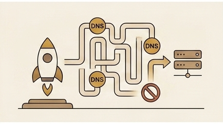

Part 2 covered the content migration — getting articles off Medium, fixing the broken Markdown, and designing a folder taxonomy that could scale. By the end of that work, the platform had a build pipeline, a content tree, and a CloudFront distribution serving pages from S3. Everything worked locally and against the default CloudFront hostname. The next step was pointing a real domain at it.

## Going Live

The expected path was simple: register the domain, point its nameservers at Route 53, create the hosted zone in Terraform, and let Terraform manage every DNS record from that point forward. Route 53 would be the single authoritative DNS provider, ACM would issue TLS certificates validated by DNS records that Terraform created automatically, and the entire serving path from domain to browser would be infrastructure-as-code. No manual steps, no split-brain DNS, no records living outside version control.

That was the plan. The domain I wanted was `formoseaniap.com`, and I bought it directly on Cloudflare because it was cheaper than registering through Route 53. Cloudflare offers domain registration at cost — no markup — which made it the obvious choice for a budget-conscious personal project. The registration went through without issues, the domain was active, and I was ready to point it at my infrastructure. What I did not anticipate was that buying the domain on Cloudflare would lock me out of the one thing I needed to do next.

The practical consequence was immediate: the site was ready to serve, the CloudFront distribution was configured, the ACM certificate request was waiting for DNS validation, and I could not point the domain's nameservers at Route 53. The default CloudFront hostname still worked, but `formoseaniap.com` was stuck on Cloudflare's nameservers — registered, active, and completely unusable for the Terraform-managed DNS setup I had planned. In hindsight, I regretted not spending the few extra dollars to register through Route 53, which would have given me immediate nameserver control.

## The 60-Day Nameserver Lock

When you register a new domain on Cloudflare, Cloudflare becomes the registrar and sets its own nameservers as authoritative. Cloudflare imposes a 60-day lock during which you cannot change the domain's nameservers to a different provider. This is tied to ICANN's transfer policy — the same 60-day window that prevents transferring a newly registered domain to another registrar also locks the nameserver delegation. The practical effect is the same regardless of the underlying reason: for 60 days after registration, the domain's nameservers are frozen on Cloudflare's nameservers, and you cannot delegate DNS authority to Route 53 or anyone else.

I discovered this after the registration completed. The Cloudflare dashboard showed the domain as active on their nameservers, and the option to change nameservers was grayed out with a note about the lock period. The timeline was concrete: the domain was registered on April 14, so the lock would expire around June 13 — roughly two months of waiting before I could execute the DNS migration I had planned.

The frustrating part was that this was entirely avoidable. If I had registered the domain through Route 53 instead of Cloudflare, the nameservers would have been Route 53's from the start, and there would have been no migration to wait for. I chose Cloudflare because it was cheaper — Cloudflare sells domains at cost with no markup — but the few dollars I saved cost me two months of manual DNS mirroring. The lesson was cheap in terms of money but expensive in terms of operational overhead.

## The Workaround: DNS-Only Mirroring

Since Route 53 could not be authoritative yet, the workaround was to accept Cloudflare as the live DNS provider and run it in DNS-only mode — meaning Cloudflare resolves DNS queries but does not proxy HTTP traffic. Every DNS record that Terraform manages in Route 53 would need to be manually created in Cloudflare as well. Cloudflare would serve the records to the internet; Route 53 would hold the canonical copies that Terraform controls, waiting for the day it becomes authoritative.

In practice, this meant a parallel workflow for every DNS change. I would run `terraform apply`, which would create or update records in the Route 53 hosted zone. Then I would log into the Cloudflare dashboard, find the corresponding record, and create or update it manually to match. The Cloudflare records had to be set to "DNS only" (the gray cloud icon, not the orange proxied icon) so that Cloudflare would return the actual IP addresses or CNAME targets rather than Cloudflare's own proxy IPs. If I accidentally left a record in proxied mode, the traffic would route through Cloudflare's edge network instead of going directly to CloudFront, which would break TLS certificate validation and cause unexpected behavior.

This dual-maintenance approach was fragile by design. There was no automation linking the two systems — no webhook, no sync script, no Terraform provider managing Cloudflare records. Every time Terraform outputted a new record value (a CloudFront distribution domain name, an ACM validation CNAME, a Cognito custom domain target), I had to copy it by hand into Cloudflare. If I forgot a record, or mistyped a value, or left a record in proxied mode, the site would break in ways that were not immediately obvious. The failure mode was usually "it works for me but not for anyone else," because my local DNS cache might still have the old record while the rest of the internet saw the broken one.

The saving grace was that the record set was small. The platform needed a handful of records — the apex domain, the `www` subdomain, the ACM validation CNAMEs, and later the Cognito auth subdomain. Manually mirroring five or six records was tedious but manageable. If the platform had needed dozens of records, this approach would have been untenable, and I would have needed to invest in a Cloudflare Terraform provider or a sync script. For a small record set and a known 60-day window, manual mirroring was the pragmatic choice.

## SSL Errors and Certificate Validation

The first `terraform apply` after setting up the domain configuration stopped partway through, waiting on ACM certificate validation. ACM issues TLS certificates for free, but it needs to verify that you control the domain. The standard method is DNS validation: ACM gives you a CNAME record to create, and once it can resolve that record, it issues the certificate. Terraform's `aws_acm_certificate_validation` resource blocks until ACM confirms the certificate is issued.

The problem was that Terraform created the validation CNAME records in Route 53, which was not the authoritative DNS provider. The records existed in Route 53's hosted zone, but no one on the internet could see them because Cloudflare's nameservers were the ones answering DNS queries for `formoseaniap.com`. ACM's validation check queried the public DNS, got no answer for the validation CNAME, and the certificate stayed in "pending validation" indefinitely. The `terraform apply` hung, waiting for a validation that would never complete.

The fix was manual: I looked at the Terraform output for the ACM validation records — each one a CNAME with a name like `_acm-challenge.formoseaniap.com` pointing to an ACM-owned validation target — and created those exact records in Cloudflare. Once the records were live in Cloudflare's DNS, ACM's validation check found them within a few minutes, the certificates were issued, and the `terraform apply` could proceed past the validation step.

This became a recurring pattern for the duration of the DNS split. Any Terraform resource that depended on DNS validation — ACM certificates, Cognito custom domains, anything that checked for the existence of a DNS record — would fail on the first apply because the records only existed in Route 53. The workflow was always the same: run `terraform apply`, watch it stop at a DNS-dependent step, read the Terraform output for the record values, create them manually in Cloudflare, wait for propagation, and rerun the apply. It worked, but it added a manual step to every infrastructure change that touched DNS.

## Apex CNAME Flattening

The site uses `www.formoseaniap.com` as the canonical hostname, with the apex domain `formoseaniap.com` redirecting to `www`. In Route 53, the apex record is an alias record — a Route 53-specific feature that lets you point the apex (a bare domain with no subdomain prefix) at an AWS resource like a CloudFront distribution without using a CNAME. This matters because the DNS specification does not allow CNAME records at the zone apex; alias records are Route 53's workaround for that limitation.

Cloudflare does not support Route 53 alias records — they are a proprietary Route 53 feature, not a standard DNS record type. But Cloudflare has its own solution for the same problem: CNAME flattening. When you create a CNAME record at the apex in Cloudflare, Cloudflare resolves the CNAME target to its final IP addresses and returns those IPs as A/AAAA records in the DNS response. The end result is the same — the apex domain resolves to the correct IP addresses — but the mechanism is different. Cloudflare is doing the resolution on your behalf and presenting the result as if it were a native A record.

This meant I could not simply copy the Route 53 alias record into Cloudflare. In Route 53, the apex record was an alias pointing to the CloudFront distribution's domain name. In Cloudflare, I created a CNAME record at the apex pointing to the same CloudFront distribution domain name, and Cloudflare's CNAME flattening handled the rest. The record looked different in each provider's dashboard, but the end result — a browser resolving `formoseaniap.com` to CloudFront's IP addresses — was the same.

The subtlety was in the DNS-only mode requirement. CNAME flattening works regardless of whether the record is proxied or DNS-only, but if the record is proxied, Cloudflare returns its own edge IPs instead of CloudFront's IPs. For the apex redirect to work correctly through CloudFront (which handles the 301 redirect to `www`), the record had to be DNS-only so that the browser connected directly to CloudFront. Getting this wrong would route apex traffic through Cloudflare's proxy, which would either serve a Cloudflare error page (if no Cloudflare-side configuration existed for the domain) or interfere with CloudFront's redirect behavior. I made this mistake once, saw a Cloudflare error page instead of the expected redirect, and learned to double-check the proxy status on every record.

## Debugging with `dig`

The `dig` command became my primary diagnostic tool throughout the DNS setup. When something was not resolving correctly, `dig` told me exactly what the DNS infrastructure was doing, without any browser caching or OS-level DNS caching getting in the way.

The first check was always which nameservers were authoritative for the domain. Running `dig NS formoseaniap.com` showed Cloudflare's nameservers in the answer section, confirming that the domain was still delegated to Cloudflare and that Route 53 was not yet in the picture. This was the baseline: any DNS record I wanted the world to see had to exist in Cloudflare, not just in Route 53.

Verifying individual records was the next step. `dig A formoseaniap.com` showed whether the apex resolved to IP addresses (confirming CNAME flattening was working) or returned no answer (meaning the record was missing or misconfigured in Cloudflare). `dig CNAME www.formoseaniap.com` confirmed that the `www` subdomain pointed to the CloudFront distribution's domain name. For ACM validation records, `dig CNAME _acm-challenge.formoseaniap.com` confirmed whether the validation CNAME had propagated — if it returned the expected ACM target, the certificate would validate; if it returned nothing, I needed to check whether I had created the record in Cloudflare or only in Route 53.

Confirming DNS-only mode was critical. When a Cloudflare record is in proxied mode, `dig` returns Cloudflare's edge IP addresses (typically in the `104.x.x.x` or `172.x.x.x` ranges). When the record is in DNS-only mode, `dig` returns the actual target's IP addresses — in this case, CloudFront's IPs. If I saw Cloudflare IPs in the `dig` output for a record that should have been DNS-only, I knew the proxy toggle was wrong. This check caught several misconfigurations before they caused visible problems.

TTL values in the `dig` output helped me understand propagation delays. Cloudflare's default TTL for DNS-only records is 300 seconds (5 minutes), which meant that after creating or changing a record, I could expect the change to be visible globally within 5 minutes. If I was still seeing stale results after that window, the problem was usually my local DNS resolver caching the old record, and switching to a public resolver like `dig @8.8.8.8 A formoseaniap.com` confirmed whether the change had actually propagated.

## The Cognito Custom Domain Trap

Amazon Cognito's managed login feature allows you to use a custom domain for the authentication UI — in my case, `auth.formoseaniap.com` instead of the default Cognito-provided domain. This gives the login page a professional appearance and keeps the user on a recognizable domain throughout the authentication flow. Setting up the custom domain in Terraform was straightforward: create an ACM certificate for `auth.formoseaniap.com`, validate it, and configure the Cognito user pool to use it.

The trap was in how Cognito validates the parent domain. When you configure a custom domain like `auth.formoseaniap.com`, Cognito checks that the parent domain `formoseaniap.com` has a valid DNS A record. This is Cognito's way of verifying that you actually control the domain — if the parent domain does not resolve, Cognito refuses to create the custom domain resource. The check is not looking for a specific IP address; it just needs the A record to exist and return something.

This check interacted badly with the DNS split. The apex domain `formoseaniap.com` was configured as a CNAME-flattened record in Cloudflare, which resolved to CloudFront's IP addresses. In theory, this should have satisfied Cognito's A record check. In practice, the timing and resolution path mattered. If the Cognito validation check ran before the CNAME flattening had fully propagated, or if it resolved through a path that did not see the flattened record, the check would fail and `terraform apply` would error out with a message about the parent domain not having a valid A record.

The fix was to create a temporary placeholder A record for `formoseaniap.com` directly in Cloudflare — a simple A record pointing to a known IP address, set to DNS-only mode. This gave Cognito's validation check an unambiguous A record to find, without relying on CNAME flattening or propagation timing. With the placeholder in place, I ran `terraform apply` again, and the Cognito custom domain resource was created successfully. After the Cognito setup was complete, I replaced the temporary A record with the proper CNAME-flattened record pointing to the CloudFront distribution, which is what the apex domain needed for normal operation.

This was the kind of problem that does not appear in any tutorial or documentation. Cognito's requirement for a parent domain A record is mentioned in the AWS docs, but the interaction with CNAME flattening and the timing sensitivity of the validation check are not. The workaround — a temporary placeholder A record — is not elegant, but it is reliable. The Cognito custom domain only checks the parent domain during creation; once the resource exists, it does not re-validate, so the temporary record can be safely removed after the initial setup.

## The Current State and What Comes Next

As of this writing, Cloudflare remains the live DNS provider for `formoseaniap.com`. Every DNS query for the domain is answered by Cloudflare's nameservers, and every record that matters — the apex, the `www` CNAME, the ACM validation CNAMEs, the Cognito auth subdomain — exists in both Cloudflare and Route 53. Cloudflare serves the live traffic; Route 53 holds the Terraform-managed canonical copies, waiting.

The 60-day nameserver lock is the only thing standing between the current state and the target architecture. Once the lock expires — the estimate is around June 13, sixty days from the April 14 registration — the plan is to update the domain's nameservers from Cloudflare to Route 53. At that point, Route 53 becomes the single authoritative DNS provider, Terraform manages every record without manual mirroring, and the Cloudflare records become irrelevant. The eventual goal after that is to enable DNSSEC on Route 53, adding cryptographic verification to DNS responses.

Until then, every infrastructure change that touches DNS carries a manual tax. Each `terraform apply` that creates or modifies a DNS record requires a corresponding manual update in Cloudflare. Each new ACM certificate requires manual creation of validation records. Each new subdomain requires checking that the record exists in both places and that the Cloudflare record is set to DNS-only mode. It is a small tax for a small record set, but it is a tax nonetheless — and it is the kind of operational overhead that accumulates silently until you forget one record and spend an hour debugging why something stopped working.

The broader lesson from this episode is about where you register your domain. The DNS migration would have been unnecessary if I had registered the domain through Route 53 instead of Cloudflare. I chose Cloudflare for the lower price — domain registration at cost, no markup — but the savings were trivial compared to the two months of manual DNS mirroring that followed. The workaround was manageable, but the extra complexity — manual mirroring, split-brain DNS, temporary placeholder records — was entirely self-inflicted. Next time, I will register the domain with the provider I intend to use as the authoritative DNS, even if it costs a few dollars more. The operational simplicity is worth more than the registration discount.

Part 4 picks up after the site is live and serving traffic, and covers the operational surprises that followed: stale Cloudflare caches hiding new deploys, a podcast CORS puzzle, GitHub Actions OIDC debugging, and a deploy that broke every stylesheet on the site.
