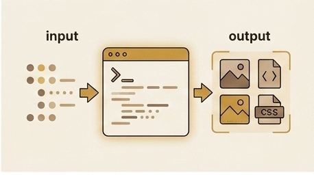

Part 3 ended with the site live and serving traffic through CloudFront, with Cloudflare handling DNS in front of it. The domain resolved, the pages loaded, TLS worked, and the manual DNS mirroring workaround was holding. Everything seemed stable. Then the operational surprises started arriving, one after another, each one exposing an assumption I had not examined closely enough. This part covers four of them: a stale cache that hid a deploy, a CORS error that required rethinking how the browser sees origins, an OIDC authentication chain that refused to cooperate, and a deploy command that silently broke every stylesheet on the site.

## The Stale HTML Problem

The first surprise came after a routine deploy. I had merged a PR that updated the site's CSS and made changes to `about.html`. The GitHub Actions `push-main` workflow ran successfully — I could see in the logs that `about.html` was uploaded to S3, the CloudFront invalidation completed, and the new CSS files were in place. When I loaded the site, the CSS changes were visible immediately. The stylesheet looked correct. But `about.html` still showed the old content.

I checked the obvious things first. The PR was merged, the workflow had run, the S3 bucket contained the new `about.html` — I verified this by downloading the object directly from S3 and comparing it to the source. The file in S3 was the new version. The CloudFront invalidation had completed without errors, and the invalidation status showed as "Completed" in the AWS console. The new CSS was loading correctly, which meant CloudFront was serving fresh content for at least some file types. But the HTML page was stale.

The evidence was contradictory: CloudFront had invalidated its cache and was serving new CSS, but the HTML page was old. If CloudFront were the only cache in the serving path, this would not make sense — an invalidation that refreshed CSS but not HTML would require a selective cache bug that does not exist. The missing piece was that CloudFront was not the only cache. Cloudflare was sitting in front of CloudFront, resolving DNS and — as it turned out — caching HTTP responses on its own edge network. The browser's request for `about.html` was hitting Cloudflare's cache first, getting a stale copy, and never reaching CloudFront at all.

## Diagnosing the Double Cache

The key to separating CloudFront's behavior from Cloudflare's behavior was in the response headers. When I loaded the page normally through the browser and inspected the response headers, I saw `cf-cache-status: HIT` — Cloudflare was serving the page from its own cache. The `x-cache` header from CloudFront was absent entirely, because the request never reached CloudFront. Cloudflare had a cached copy and returned it before the request could travel any further.

To confirm that CloudFront was serving the correct content, I needed to bypass Cloudflare and hit CloudFront directly. The `curl --resolve` flag lets you override DNS resolution for a specific hostname, so I could point `www.formoseaniap.com` at CloudFront's IP address instead of letting Cloudflare's DNS resolve it. Running `curl --resolve www.formoseaniap.com:443:<cloudfront-ip> https://www.formoseaniap.com/about.html -I` returned the new version of the page with `x-cache: Miss from cloudfront` (since the invalidation had cleared CloudFront's cache) and the correct `Content-Length` matching the new file. CloudFront was fine. The stale content was entirely in Cloudflare's cache layer.

The immediate fix was to purge the exact URL in Cloudflare's dashboard. I navigated to the Caching section, selected "Purge by URL," entered the full URL for `about.html`, and submitted the purge. Within seconds, the next browser request returned the new content with `cf-cache-status: MISS`, and subsequent requests showed `cf-cache-status: HIT` with the correct content now cached.

The prevention rule going forward was straightforward: when CloudFront is the primary CDN and Cloudflare is in front of it as a DNS provider, you have two caches to think about, not one. Either purge Cloudflare for changed HTML pages after every deploy — which means adding a Cloudflare API call to the GitHub Actions workflow — or configure Cloudflare's caching rules to skip HTML entirely when CloudFront is already handling CDN caching. The second option is simpler for a static site where CloudFront's cache behavior is already tuned: let CloudFront own the caching decisions, and tell Cloudflare to pass HTML through without storing it. For assets like CSS and JS that are fingerprinted with content hashes in their filenames, Cloudflare caching is harmless because the filenames change on every deploy. It is only the non-fingerprinted resources — HTML pages with stable URLs — that create the stale-content problem.

## The Podcast CORS Puzzle

The podcast page on the site fetches RSS feeds from a third-party podcast hosting provider. The page loads in the browser, JavaScript makes a `fetch()` call to the podcast provider's RSS endpoint, parses the XML response, and renders the episode list. This worked perfectly in local development, where the browser's same-origin policy was not a factor because the dev server and the fetch target were both running in a permissive local context. In production, the browser blocked the fetch with a CORS error.

The error was the standard `Access-Control-Allow-Origin` violation: the browser sent a request from `https://www.formoseaniap.com` to the podcast provider's domain, the provider's response did not include the `Access-Control-Allow-Origin` header, and the browser refused to let JavaScript read the response. This is the browser enforcing the same-origin policy — a security mechanism that prevents a page on one domain from reading responses from a different domain unless the target domain explicitly opts in via CORS headers.

The initial AI-proposed solution was to add CORS headers via a CloudFront response headers policy. The idea was plausible: create a response headers policy that injects `Access-Control-Allow-Origin: *` into responses, attach it to the relevant CloudFront cache behavior, and the browser would see the header and allow the fetch. This approach works in general — CloudFront response headers policies are a legitimate way to add headers to responses — but it assumed a feature that was not available. The CloudFront Free plan forbids custom response headers policies. The same pricing-tier restriction that would later block custom cache policies (a story for Part 6) also blocked this fix. The plan looked correct on paper, but the platform constraint made it impossible.

## Same-Origin Routing Through CloudFront

The real fix came from rethinking the problem. Instead of trying to add CORS headers to a cross-origin response, I could eliminate the cross-origin request entirely. If the browser's `fetch()` call went to a path on the same domain — say, `https://www.formoseaniap.com/podcasts/feed.xml` — then from the browser's perspective, the request was same-origin. Same domain, same protocol, same port. The same-origin policy does not apply, and CORS headers are not needed.

The implementation used CloudFront's cache behavior and origin routing. I added a new cache behavior for the path pattern `/podcasts/*` on the same CloudFront distribution that serves the main site. This behavior pointed to a new origin: the podcast feed provider's domain. When the browser requested `https://www.formoseaniap.com/podcasts/feed.xml`, CloudFront matched the `/podcasts/*` behavior, forwarded the request to the podcast provider's origin, received the RSS XML response, and returned it to the browser. The browser saw a response from `www.formoseaniap.com` — the same origin as the page — and allowed JavaScript to read it without any CORS negotiation.

This pattern — routing third-party API calls through your own CDN distribution as a same-origin proxy — is simpler and more reliable than trying to fix CORS on feeds you do not control. You cannot add CORS headers to someone else's server. You can ask them to add the headers, but that depends on their willingness and timeline. You can set up a separate proxy server, but that adds infrastructure to maintain. Routing through CloudFront as a cache behavior costs nothing extra (the distribution already exists), requires no server-side code, and works for any HTTP-based third-party resource. The key lesson was that "same-origin via CloudFront behavior and origin routing" should be the first option to consider when a static site needs to fetch from a third-party API, not the fallback after CORS fixes fail.

## GitHub Actions OIDC Debugging

The CI/CD pipeline uses GitHub Actions with OpenID Connect (OIDC) for AWS authentication. The mental model is a three-step chain: GitHub Actions generates a short-lived OIDC token that identifies the workflow run, AWS Security Token Service (STS) receives that token via `AssumeRoleWithWebIdentity`, verifies it against the configured OIDC identity provider, and returns temporary AWS credentials scoped to a specific IAM role. The workflow then uses those credentials to run Terraform, sync files to S3, invalidate CloudFront caches, and perform other AWS operations. No long-lived AWS access keys are stored in GitHub — the credentials are generated on the fly for each workflow run and expire shortly after.

The debugging stories all centered on the trust policy — the IAM policy document that defines which OIDC tokens are allowed to assume the role. The trust policy specifies conditions on the token's claims, and if any condition does not match the actual token, STS returns `AccessDenied` with minimal explanation. The error message tells you the assumption was denied but does not tell you which condition failed, which makes debugging a process of elimination.

The first issue was a mis-scoped `sub` claim. The OIDC token's `sub` (subject) claim identifies the specific GitHub repository, branch, and environment that generated the token. The trust policy had a condition like `StringEquals` on the `sub` claim, expecting a specific branch pattern — for example, `repo:owner/repo:ref:refs/heads/main`. If the workflow ran on a different branch, or if the `sub` claim format did not match exactly (GitHub occasionally changes the claim format for different trigger types like `pull_request` vs `push`), the assumption failed. The fix was to review the actual `sub` claim value by decoding the OIDC token in the workflow logs and adjusting the trust policy condition to match the real claim format. In some cases, switching from `StringEquals` to `StringLike` with a wildcard pattern was necessary to accommodate multiple trigger types.

The second issue was wrong audience values. The OIDC token includes an `aud` (audience) claim that must match the audience configured in the AWS OIDC identity provider. If the GitHub Actions workflow specified a different audience than what the AWS provider expected, the token validation failed before the trust policy conditions were even evaluated. The default audience for GitHub Actions OIDC is `sts.amazonaws.com`, but if the workflow or the AWS provider configuration used a different value, the mismatch caused a silent `AccessDenied`. Aligning the audience value on both sides resolved this.

The third issue was permission policies that were too narrow for what Terraform needed. Even after the OIDC assumption succeeded, the IAM role's permission policy had to grant access to every AWS API call that Terraform would make. During `terraform plan`, Terraform reads the current state of every managed resource, which requires `Describe`, `Get`, and `List` permissions across all the services in the configuration. During `terraform apply`, it additionally needs `Create`, `Update`, and `Delete` permissions. If the permission policy was missing a single action — say, `cloudfront:GetDistribution` or `s3:PutBucketPolicy` — the Terraform run would fail partway through with an `AccessDenied` on that specific API call. The fix was iterative: run the plan or apply, find the denied action in the error output, add it to the permission policy, and repeat until the full run succeeded. Over time, this produced a well-scoped permission policy that covered exactly what Terraform needed and nothing more.

## The Deploy MIME Type Breakage

The most dramatic failure was the one that broke every stylesheet on the site. The deploy step in the GitHub Actions workflow used `aws s3 cp` to upload built assets to the S3 bucket. For fingerprinted CSS and JavaScript files — files with content hashes in their filenames that never change once deployed — the command included `--cache-control "public, max-age=31536000, immutable"` to tell browsers and CDNs to cache them indefinitely. The `--metadata-directive REPLACE` flag was necessary to stamp the `Cache-Control` header onto the S3 objects, because without it, `aws s3 cp` preserves the existing metadata and ignores the new `--cache-control` value.

The problem was that `--metadata-directive REPLACE` does exactly what it says: it replaces all metadata on the object, not just the metadata you specified. When S3 receives an upload with `--metadata-directive REPLACE` and `--cache-control`, it sets the `Cache-Control` header as requested — but it also clears every other metadata field that was not explicitly provided in the command, including `Content-Type`. Without an explicit `--content-type` in the command, S3 fell back to its default: `binary/octet-stream`.

The result was that every CSS file in the S3 bucket was now served with `Content-Type: binary/octet-stream` instead of `text/css`. On its own, this might have been survivable — many browsers will still apply a stylesheet served with the wrong MIME type, using a behavior called "MIME type sniffing." But the CloudFront distribution had a security header configured: `X-Content-Type-Options: nosniff`. This header tells the browser to trust the `Content-Type` header literally and not attempt to sniff the actual content type. With `nosniff` in place, the browser saw a resource claiming to be `binary/octet-stream`, respected that claim, and refused to treat it as a stylesheet. Every CSS file on the site was blocked. The pages loaded with zero styling — raw HTML with no layout, no colors, no fonts.

The failure was not immediately obvious from the deploy logs. The `aws s3 cp` command succeeded, the files were uploaded, the CloudFront invalidation completed, and the workflow reported success. The breakage was only visible when loading the site in a browser and opening the developer console, where the browser reported that it refused to apply the stylesheets because of a MIME type mismatch. The same issue affected JavaScript files, though the visual impact of broken CSS was more immediately noticeable than broken JS.

## The MIME Type Fix

The fix was to split the single `aws s3 cp` pass into separate passes for each file type, with explicit `--content-type` on each. CSS files got `--content-type text/css`, JavaScript files got `--content-type application/javascript`. Each pass still included `--metadata-directive REPLACE` and the `--cache-control` header, but now the `Content-Type` was explicitly set rather than being silently cleared.

The deploy step went from one command that handled all fingerprinted assets to two commands — one for CSS, one for JS — each with the correct MIME type. Both the main site and the engineering site deploy steps needed the same update, since both used the same `aws s3 cp` pattern with `--metadata-directive REPLACE`. The change was small in terms of lines of code, but the lesson was significant: `--metadata-directive REPLACE` is a footgun. The name suggests it replaces the metadata you are providing, but it actually replaces the entire metadata set. Any metadata field you do not explicitly include in the command is wiped. If you are using `REPLACE` to set `Cache-Control`, you must also set `Content-Type`, `Content-Encoding`, and any other metadata field that matters. The safe default is to always specify `--content-type` whenever you use `--metadata-directive REPLACE`, even if you think S3 will infer it correctly — because with `REPLACE`, it will not.

The interaction with `X-Content-Type-Options: nosniff` made the failure total rather than partial. Without `nosniff`, browsers would have sniffed the CSS content and applied it despite the wrong MIME type, and the breakage might have gone unnoticed for weeks — a silent correctness issue rather than a visible outage. In a way, the `nosniff` header did its job: it turned a subtle metadata error into an obvious, impossible-to-ignore failure. The security header made the bug louder, which made it faster to diagnose and fix. That is the argument for keeping `nosniff` enabled even when it causes pain: it surfaces problems that would otherwise hide.

## Checklists

Each of these operational surprises produced a checklist that I now run through on every deploy or infrastructure change. They are simple, but they encode the lessons from each failure in a form that is easy to follow without having to remember the full debugging story.

### Cache Debugging Checklist

When deployed content appears stale or incorrect, work through the serving path from the browser backward:

1. Check the response headers for `cf-cache-status` (Cloudflare) and `x-cache` (CloudFront). If `cf-cache-status` is `HIT`, Cloudflare is serving a cached copy and the request may never be reaching CloudFront.
2. Use `curl --resolve <hostname>:443:<cloudfront-ip>` to bypass Cloudflare and hit CloudFront directly. Compare the response to what the browser sees. If CloudFront returns the correct content but the browser does not, the stale content is in Cloudflare's cache.
3. Inspect both CDN layers independently. A CloudFront invalidation only clears CloudFront's cache. If Cloudflare is also caching the resource, you need a separate Cloudflare purge for the same URL.
4. For fingerprinted assets (CSS/JS with content hashes in filenames), Cloudflare caching is generally safe because the filename changes on every deploy. For non-fingerprinted resources (HTML pages with stable URLs), either configure Cloudflare to bypass caching or add a Cloudflare purge step to the deploy pipeline.

### CORS Debugging Checklist

When the browser blocks a fetch with a CORS error:

1. Open the browser's Network tab and inspect the failed request. Look at the response headers — specifically, whether `Access-Control-Allow-Origin` is present and whether its value matches the requesting origin.
2. Determine whether you control the target server. If you do not control the server (third-party API, external RSS feed), you cannot add CORS headers to its responses.
3. Before attempting to fix CORS headers, consider whether the request can be made same-origin instead. If the target can be routed through your own CDN distribution as a separate cache behavior with the third-party server as the origin, the browser sees a same-origin request and CORS does not apply.
4. If using CloudFront, verify that the cache behavior for the proxied path matches the correct origin and that the origin's domain name and protocol are configured correctly. A misconfigured origin will return errors that look like CORS failures but are actually connectivity failures.

### OIDC Debugging Checklist

When GitHub Actions OIDC authentication fails with `AccessDenied`:

1. Decode the OIDC token from the workflow run to inspect the actual claim values (`sub`, `aud`, `iss`). Compare them against the trust policy conditions on the IAM role.
2. Check the `sub` claim format. GitHub Actions uses different `sub` formats for different trigger types (`push`, `pull_request`, `workflow_dispatch`). If the trust policy uses `StringEquals`, it must match the exact format. Consider `StringLike` with wildcards if the role needs to work across multiple trigger types.
3. Verify the `aud` (audience) claim matches the audience configured in the AWS OIDC identity provider. The default is `sts.amazonaws.com`, but mismatches here cause silent failures.
4. After the OIDC assumption succeeds, check the IAM role's permission policy. `terraform plan` requires read-only permissions (`Describe`, `Get`, `List`) across all managed services. `terraform apply` additionally requires write permissions (`Create`, `Update`, `Delete`). Missing a single action causes a mid-run `AccessDenied` on that specific API call.

### Deploy Checklist

After any deploy that modifies S3 object metadata:

1. If using `--metadata-directive REPLACE` with `aws s3 cp`, verify that `--content-type` is explicitly set for every file type. `REPLACE` clears all metadata not specified in the command, including `Content-Type`.
2. After the deploy, spot-check the `Content-Type` of uploaded objects using `aws s3api head-object` or by inspecting response headers in the browser's Network tab. Look for `binary/octet-stream` on files that should be `text/css`, `application/javascript`, or `text/html`.
3. If the CloudFront distribution uses `X-Content-Type-Options: nosniff`, a wrong `Content-Type` will cause browsers to reject the resource entirely rather than sniffing the correct type. This turns a metadata error into a total outage for the affected file type.
4. Test the deploy in a staging environment or against a non-production CloudFront distribution before applying to production, especially when changing the `aws s3 cp` flags or adding new file types to the deploy pipeline.

Part 5 shifts from operational firefighting to an architecture decision: splitting the personal site into a professional engineering portfolio, the subdomain approach that hit the CloudFront distribution limit, and the path-based routing design that replaced it.
