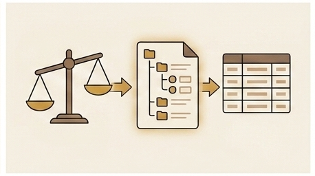

Part 4 ended with the operational fires under control — stale caches purged, CORS resolved through same-origin routing, OIDC claims aligned, and MIME types explicitly set. The site was stable, the deploy pipeline was reliable, and the content was flowing. Then someone looked at the site not as a builder, but as a hiring manager, and the feedback changed the direction of the project entirely.

## The Feedback That Started It

A reviewer I trusted told me, plainly, that the site was confusing. Not broken, not ugly — confusing. The problem was that the site was a personal platform first: podcasts, anime reviews, civic essays, philosophy exam notes, and personal reflections all lived alongside engineering articles and project write-ups. For someone who already knew me, the breadth made sense. For a hiring manager spending thirty seconds deciding whether to click deeper, the mix was noise. They were looking for an engineering snapshot — projects, technical writing, professional background — and instead they landed on a page where a Terraform article sat next to an Attack on Titan essay.

The feedback was not about quality. The personal content was fine on its own terms. The problem was context. A hiring manager evaluating an engineering candidate does not want to scroll past podcast episodes and personal reflections to find the technical work. They want a clean signal: what has this person built, what do they know, and how do they think about engineering problems. The personal site was optimized for self-expression, not for that signal. The two goals were not incompatible, but they needed separate surfaces.

I sat with the feedback for a few days before deciding to act on it. The conclusion was that the site needed a dedicated engineering section — a place where the technical content, the project portfolio, and the professional background could stand on their own without competing with the personal material. The main site would keep everything: podcasts, artworks, personal essays, the personal About page. The engineering section would get a CV-derived landing page, technical-only article filtering, and a projects page aimed at hiring managers. Two audiences, two surfaces, one platform.

## The Subdomain Approach

The obvious architecture was a subdomain. `engineer.formoseaniap.com` would be a completely separate site: its own CloudFront distribution, its own ACM TLS certificate, its own S3 bucket, its own Route 53 DNS records. The main site stays at `www.formoseaniap.com` with its existing distribution. Clean visual separation, independent cache invalidation, independent TLS lifecycle. Each site could be deployed, cached, and debugged independently without any risk of one affecting the other.

The subdomain approach was attractive for operational reasons too. A separate distribution meant a separate set of cache behaviors, so the engineering site's caching rules would not interact with the main site's. A separate ACM certificate meant the TLS renewal lifecycle was independent — if one cert had an issue, the other site would be unaffected. A separate S3 bucket was already part of the plan regardless of the routing approach, because the engineering site's content was built from a different output set (`site-eng/` instead of `site/`). The subdomain design was the natural extension of that separation all the way up the serving stack.

I started sketching the Terraform resources: a new `aws_cloudfront_distribution` for the engineering site, a new `aws_acm_certificate` with DNS validation, new Route 53 records for `engineer.formoseaniap.com`, and the OAC configuration to connect the new distribution to the engineering S3 bucket. The design was clean and conventional. Then I checked the distribution limit.

## The Distribution Limit

AWS CloudFront's Free pricing plan allows 3 distributions per account. That limit is fixed — it cannot be increased through a support request or a quota adjustment. It is a hard constraint of the pricing tier. I was already using one distribution for the main site. Adding a second distribution for the engineering section would leave exactly one slot for every future project, experiment, or side deployment that might need its own CloudFront distribution.

The cost arithmetic was not the issue. The Free plan's included traffic and request limits are per-account, not per-distribution, so running two distributions would not cost more than running one. The real constraint was the distribution-slot budget. Three slots total, two consumed by a single portfolio, one remaining for everything else — that felt like spending a scarce resource on a problem that might have a cheaper solution. If I later wanted to host a separate project, a staging environment with its own distribution, or any other CloudFront-fronted resource, I would immediately hit the ceiling.

I could have upgraded to a paid CloudFront plan, but that defeated the purpose. The entire hosting stack was designed around the Free plan's zero-cost guarantee. Paying for a higher tier just to get more distribution slots — when the traffic and bandwidth limits of the Free plan were more than sufficient — was not a tradeoff I wanted to make for a personal portfolio. The constraint was real, and the right response was to design around it rather than pay to remove it.

## The Pivot to Path-Based Routing

The alternative was path-based routing on a single distribution. Instead of `engineer.formoseaniap.com` as a separate subdomain, the engineering section would live at `www.formoseaniap.com/engineer/` as a path under the same domain. One CloudFront distribution, two S3 buckets, and an ordered cache behavior that routes `/engineer/*` requests to the engineering bucket while everything else goes to the main site bucket.

The implementation required no new ACM certificate, no new Route 53 records, and no new distribution. The existing distribution gained one additional ordered cache behavior: path pattern `/engineer/*`, pointing to a new S3 origin for the engineering bucket. The default cache behavior continued to serve the main site from the original bucket. CloudFront evaluates cache behaviors in order, so the `/engineer/*` pattern matches first for any request under that path, and everything else falls through to the default.

The tradeoff was that the two sites now shared a distribution, which meant shared cache invalidation scope and a shared TLS certificate. In practice, this was not a problem. The wildcard invalidation (`/*`) that the deploy pipeline already used covered both sites in a single call — one distribution, one invalidation. The TLS certificate already covered `www.formoseaniap.com`, and since the engineering section was now a path under that same domain rather than a separate hostname, no certificate change was needed. The operational simplicity of one distribution turned out to be a feature, not a compromise.

## The CloudFront Function

A CloudFront Function named `engineer-path-rewrite` handles one specific job for the `/engineer/*` cache behavior: resolving directory-style requests to `index.html`. When a browser requests `/engineer/`, the function rewrites the URI to `/engineer/index.html` before the request reaches the S3 origin. Without this rewrite, S3 would receive a request for the key `engineer/` — which is not an object — and return a 404.

The critical design decision was what the function does not do. It does not strip the `/engineer` prefix from the URI. An earlier version of the function did strip the prefix — rewriting `/engineer/projects.html` to `/projects.html` before the origin fetch — and that design caused a production cache collision that is the subject of Part 6. The prefix-stripping approach meant that the rewritten URI `/projects.html` was identical whether the request came from the default behavior or the `/engineer/*` behavior. Under the shared AWS-managed CachingOptimized cache policy, which keys only on the URI, both behaviors produced the same cache key. First writer wins, and then both sites serve the same content.

The fix was to keep the `/engineer` prefix in the URI all the way through to the origin. The function only handles the directory-index case: if the URI ends with `/`, append `index.html`. If the URI is `/engineer/projects.html`, it passes through unchanged. The S3 origin receives the full `/engineer/projects.html` path, which maps to the object key `engineer/projects.html` in the engineering bucket. The cache key is `/engineer/projects.html`, which is distinct from `/projects.html` by construction. No custom cache policy needed, no header tricks, no collision risk.

## The S3 Prefix Layout

The engineering S3 bucket stores all its files under an `engineer/` key prefix. The object for the engineering home page is `engineer/index.html`. The projects page is `engineer/projects.html`. Article data lives under `engineer/data/`. This layout means the request URI and the S3 object key share the same `/engineer/` path — the URI `/engineer/projects.html` maps directly to the S3 key `engineer/projects.html`.

This alignment is not accidental. It is the mechanism that prevents cache key collisions under the CloudFront Free plan's constraints. The Free plan only allows AWS-managed cache policies, and the AWS-managed CachingOptimized policy keys on the request URI (among other standard fields). If the engineering site's objects were stored at the bucket root — `index.html`, `projects.html` — then the CloudFront Function would need to strip the `/engineer` prefix before the origin fetch, and the cache key for `/engineer/projects.html` after stripping would be `/projects.html`, colliding with the main site's `/projects.html`. By keeping the prefix in both the URI and the S3 key, the cache keys are distinct by construction: `/engineer/projects.html` versus `/projects.html`. The shared CachingOptimized policy works correctly without any customization.

The CI/CD pipeline reflects this layout. The deploy step runs `aws s3 sync prod-artifact/site-eng/ s3://<engineering-bucket>/engineer/` — syncing the local `site-eng/` build output into the `engineer/` prefix in S3. The local build directory does not have the `engineer/` prefix in its file paths, so the sync command adds it. This is a one-line change in the deploy workflow, but it is the line that makes the entire path-based routing design work.

## The Content Split

The content model splits cleanly along the audience boundary. The main site keeps everything: podcasts, artworks, personal essays, anime and media reviews, civic writing, the personal About page. It is the full expression of the platform as a personal site. The engineering section at `/engineer/` gets a focused subset: a CV-derived landing page with skills, certifications, and work history; a projects page aimed at hiring managers showing real projects with technical context; and article filtering that shows only `category: technical` articles.

The build script, `scripts/build_articles.py`, produces two output sets from the same Markdown source files. The main site output goes to `site/data/` and includes all articles regardless of category. The engineering site output goes to `site-eng/data/` and includes only articles where `category` is `technical`. The filtering happens at build time, not at runtime — the engineering site's article index simply does not contain non-technical articles. This means the engineering site's search, listing pages, and RSS feed are all scoped to technical content without any client-side filtering logic.

The About page required a deliberate rewrite. The main site's About page uses a personal, philosophy-background voice — it talks about interests, values, and the person behind the platform. The engineering landing page takes the CV-like professional content that used to live on the personal About — skills, certifications, work history, experience bullets — and presents it in a format that hiring managers expect. The two pages serve different audiences and use different tones, even though they describe the same person. Separating them made both pages better at their respective jobs.

## The Analytics Domain Split

Both sections of the site share the same analytics API backend — a Lambda-backed API Gateway that collects page view events and stores them in DynamoDB. Before the split, every analytics event was implicitly "main site" because there was only one site. After the split, the backend needed to distinguish traffic between the two sections so that the admin dashboard could show separate metrics.

The solution was a `domain` field added to every analytics collect event. The main site sends `domain: "main"` with each event. The engineering section sends `domain: "engineering"`. The DynamoDB partition keys are domain-scoped — `PAGE#home#main` and `PAGE#home#engineering` are separate items, and the site-level aggregates use `SITE#ALL#main`, `SITE#ALL#engineering`, and a combined `SITE#ALL` for total traffic. The admin dashboard gained a domain filter so each site's traffic can be viewed independently or together.

Backward compatibility was a hard requirement because the migration had to be zero-downtime. Existing DynamoDB items — written before the domain field existed — do not have a `domain` attribute. The admin reader treats any item without a `domain` attribute as `main`, which is correct because all pre-split traffic was main-site traffic. New events use the domain-scoped keys from the moment the updated collector Lambda is deployed. No backfill migration was needed, and no existing data was modified. The schema change was purely additive.

The shared `analytics.config.json` file — which tells the frontend JavaScript where to send collect events — is written into both site trees during the CI/CD build. The main site's copy and the engineering site's copy point to the same API endpoint but include different `domain` values. This means the analytics configuration is baked into the static site at build time, not determined at runtime by inspecting the URL path.

## CI/CD Changes

The deploy pipeline in `push-main.yml` gained a few new steps to handle the two-bucket deployment. The workflow now reads `engineering_site_bucket_name` from Terraform outputs alongside the existing main site bucket name. It writes the shared `analytics.config.json` — with the appropriate `domain` value — into both `site/` and `site-eng/` build trees before syncing.

The sync step for the engineering site runs `aws s3 sync` from the `site-eng/` build artifact into the engineering bucket under the `engineer/` prefix. This is the step that creates the S3 key layout described earlier — local files like `site-eng/index.html` become `engineer/index.html` in S3. The main site sync continues to work as before, syncing `site/` to the main bucket root.

Cache invalidation required no changes. Because both sites share a single CloudFront distribution, the existing wildcard invalidation (`/*`) covers both the main site paths and the `/engineer/*` paths in one call. One distribution, one invalidation, both sites refreshed. This is one of the practical wins of the single-distribution approach — the deploy pipeline does not need to track multiple distribution IDs or run multiple invalidation calls. The OIDC permission policy only needed the engineering S3 bucket ARN added to the existing statements. No new CloudFront, ACM, or Route 53 permissions were required, because the second distribution and new certificate that would have needed them were designed away.

## Local Preview Parity

The local development server, `scripts/site_preview.py`, is a Python `SimpleHTTPRequestHandler` that serves files from the `site/` directory. Before the engineering section existed, this was sufficient — every URL the site could serve mapped to a file under `site/`. After the split, requests to `/engineer/*` would 404 locally, because the engineering site's files live in `site-eng/`, not under `site/engineer/`.

This mismatch between local and production behavior is a subtle trap. In production, CloudFront routes `/engineer/*` to a separate S3 origin containing the engineering content. Locally, there is no CloudFront, no cache behaviors, no origin routing — just a file server. If `/engineer/` works in production but 404s locally, you end up debugging phantom issues that do not exist in production, or worse, missing real issues because you cannot reproduce the production URL structure locally.

The fix was to extend `site_preview.py` with a `translate_path` override. The custom handler checks whether the request path starts with `/engineer/`. If it does, the handler maps the request to the `site-eng/` directory instead of `site/`. A request for `/engineer/index.html` locally serves the file at `site-eng/index.html`. A request for `/projects.html` (no `/engineer/` prefix) continues to serve from `site/projects.html` as before. The routing logic mirrors what CloudFront does in production: `/engineer/*` goes to one origin, everything else goes to the other.

With this change, local URLs match production URLs exactly. `http://localhost:8000/engineer/` serves the engineering home page from `site-eng/`, and `http://localhost:8000/` serves the main site from `site/`. Cross-links between the two sections work locally the same way they work in production. The investment in local preview parity was small — a few lines in the request handler — but it eliminated an entire class of "works in production but not locally" confusion.

## Cross-Linking

Every main-site page header includes an "Engineering" link pointing to `/engineer/`, and every engineering page header includes a "Main Site" link pointing back to `/`. These are ordinary internal `<a href>` tags — no absolute URLs, no cross-domain considerations, no CORS implications. Because both sections share one domain under the single-distribution design, navigating between them is the same as navigating between any two pages on the same site.

This is one of the real wins of choosing path-based routing over a subdomain. If the engineering section lived at `engineer.formoseaniap.com`, the cross-links would be absolute cross-domain URLs. They would still work — browsers follow cross-domain links without restriction — but they would look different in the address bar, they would be treated as separate sites by analytics tools and search engines by default, and any shared state (cookies, local storage) would not carry across. With path-based routing, the cross-links are just `/engineer/` and `/`, and the browser treats the entire site as one origin. Shared analytics, shared cookies, shared service worker scope — all of it comes for free because the domain never changes.

The simplicity of the cross-linking also made the HTML templates straightforward. The main site's header template has a static link to `/engineer/`. The engineering site's header template has a static link to `/`. No conditional logic, no environment-specific URL construction, no configuration files to maintain. The links are hardcoded because the URL structure is stable by design — it is baked into the CloudFront cache behavior pattern and the S3 prefix layout, neither of which changes between deploys.

Part 6 picks up where this design left off — with the first deploy of the engineering section, the CloudFront Function that stripped the `/engineer` prefix, and the cache collision that followed when two cache behaviors produced the same cache key under the shared CachingOptimized policy.
