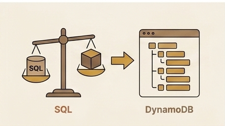

Part 5 ended with the engineering section live at `/engineer/` — path-based routing, a dedicated S3 bucket, a CloudFront Function for directory indexes, and a CI/CD pipeline that deployed both sites from a single workflow. The architecture was clean on paper. Then a viewer reported that the two sites were serving each other's content, and the next four days became a production incident that touched CloudFront caching, Terraform state management, squash-merge semantics, and a completely unrelated Monday audit failure.

## The Report

The report came from someone browsing `www.formoseaniap.com` on a weekday afternoon. They clicked the Projects link on the main site — which goes to `/projects.html` — and got the engineering projects page instead. The engineering projects page, the one that should only appear at `/engineer/projects.html`. They tried the root URL next: `https://www.formoseaniap.com/` sometimes rendered the engineering home page, while `https://www.formoseaniap.com/engineer/` sometimes rendered the main site home page. The behavior was not consistent. Different browsers saw different combinations. Incognito sessions saw yet another combination. Refreshing the same URL in the same browser sometimes flipped the content.

The inconsistency was the first clue that this was a caching problem, not a routing problem. If the CloudFront Function or the S3 origin were misconfigured, the wrong content would be served consistently — every request to `/` would get the engineering page, or every request to `/engineer/` would get the main page. The fact that different clients saw different combinations, and that the same client could see different results after a cache expiry, pointed to a cache layer that was storing the wrong content under the right key, or the right content under the wrong key, and then serving whatever it had cached to whoever asked next.

The randomness also ruled out a DNS or Cloudflare issue. Both URLs resolved to the same CloudFront distribution — there was no DNS-level routing that could swap them. Cloudflare was running in DNS-only mode for this domain, so it was not caching or transforming responses. The problem had to be inside CloudFront itself.

## How CloudFront Cache Keys Work

To understand the collision, you need to understand how CloudFront decides what to cache and how to look it up. The process has four steps, and the order matters.

First, CloudFront matches the incoming request URI against the distribution's cache behaviors. Behaviors are evaluated in order: ordered behaviors first (by their path pattern), then the default behavior as a catch-all. A request for `/engineer/projects.html` matches the `/engineer/*` ordered behavior. A request for `/projects.html` does not match any ordered behavior, so it falls through to the default. The behavior match determines which origin, which cache policy, and which CloudFront Function handle the request.

Second, if the matched behavior has a CloudFront Function attached to the viewer-request event, that function runs and can modify the request — including rewriting the URI. This rewrite happens before the cache lookup. Whatever URI the function produces is the URI that CloudFront uses for the cache key computation.

Third, CloudFront computes the cache key. The cache key is derived from the (possibly rewritten) URI plus whatever additional fields the behavior's cache policy specifies — specific headers, query strings, or cookies. The AWS-managed CachingOptimized policy, which is the default for most static site setups, keys on the URI and nothing else. No headers, no query strings, no cookies. Just the URI.

Fourth, CloudFront checks its edge cache for an entry matching that key. If it finds one (a cache hit), it returns the cached response without contacting the origin. If it does not find one (a cache miss), it fetches from the origin, stores the response under that cache key, and returns it to the client. The next request that produces the same cache key — from any behavior, from any client — gets the cached response.

The critical detail is step two: the CloudFront Function rewrites the URI before the cache key is computed. If two different incoming URIs are rewritten to the same URI, and both behaviors use the same cache policy, they produce the same cache key. The first request to miss the cache writes the entry. Every subsequent request that computes the same key reads that entry, regardless of which behavior handled it.

## The Diagnosis

I needed to confirm that the cross-contamination was happening at the CloudFront cache layer, not at S3 or somewhere else in the stack. The diagnostic tool was `curl -I` — fetching just the response headers — against four paired URLs, bypassing Cloudflare by using `--resolve` to point the hostname directly at a CloudFront edge IP.

The four pairs were: `/` and `/engineer/`, `/projects.html` and `/engineer/projects.html`, `/articles.html` and `/engineer/articles.html`, and `/about.html` and `/engineer/about.html`. For each pair, I compared the `ETag`, `Content-Length`, and `x-amz-version-id` headers in the responses.

The results were unambiguous. `/projects.html` and `/engineer/projects.html` returned identical `ETag` values, identical `Content-Length`, and identical `x-amz-version-id`. The same was true for `/` and `/engineer/`, and for the other pairs. These were not just similar responses — they were the exact same S3 object being served for both URLs. The `x-amz-version-id` header is set by S3 and uniquely identifies a specific version of an object in a versioned bucket. If two responses carry the same `x-amz-version-id`, they are literally the same bytes from the same object version.

This confirmed the problem was at the CloudFront cache layer. S3 was storing the correct objects under the correct keys — the engineering bucket had its own `projects.html` and the main bucket had its own `projects.html`. But CloudFront was caching one of them and serving it for both URLs. The cache was colliding.

## The Root Cause

The root cause was a one-line design decision in the CloudFront Function. The function, attached to the `/engineer/*` cache behavior's viewer-request event, was designed to strip the `/engineer` prefix from the URI before the request reached the S3 origin. The intent was straightforward: the engineering S3 bucket stored files at the root level — `index.html`, `projects.html`, `articles.html` — so the function needed to transform `/engineer/projects.html` into `/projects.html` to match the S3 key.

The stripping worked correctly for origin fetches. S3 received `/projects.html`, found the object, and returned the engineering site's projects page. The problem was what happened before the origin fetch: the cache key computation. After the function rewrote `/engineer/projects.html` to `/projects.html`, CloudFront computed the cache key using the rewritten URI. The cache key was `/projects.html`.

Meanwhile, the default cache behavior — handling requests for the main site — received `/projects.html` directly, with no rewrite needed. Its cache key was also `/projects.html`.

Both behaviors shared the AWS-managed CachingOptimized cache policy, which keys on the URI only. No headers, no query strings, no cookies differentiate the two behaviors in the cache key. The rewritten URI `/projects.html` from the engineering behavior and the original URI `/projects.html` from the default behavior produced the exact same cache key.

The result was a race condition at the cache layer. Whichever behavior handled the first cache miss for `/projects.html` wrote its origin's response into the cache. If the main site's `/projects.html` was fetched first, the engineering site's `/engineer/projects.html` would serve the main site's content from cache. If the engineering site's `/engineer/projects.html` was fetched first, the main site's `/projects.html` would serve the engineering content. First writer wins, and the loser gets the wrong content until the cache entry expires or is invalidated. Different edge locations could have different winners, which explained why different browsers and incognito sessions saw different combinations of the swap.

## Stage 1: The Custom Cache Policy Fix

The first fix attempt was conceptually clean. If the problem was that both behaviors produced the same cache key, the solution was to make the cache keys different. The plan: have the CloudFront Function attach a custom header — `x-origin: engineering` — to every `/engineer/*` request, then create a custom cache policy for the engineering behavior that includes `x-origin` in the cache key fields. The default behavior would keep the standard CachingOptimized policy (URI only), while the engineering behavior would key on URI plus `x-origin`. Even after the function stripped `/engineer` from the URI, the cache key for the engineering behavior would be `/projects.html` + `x-origin: engineering`, which is distinct from the default behavior's `/projects.html` with no `x-origin` header.

I wrote the Terraform changes: a new `aws_cloudfront_cache_policy` resource named `engineering_site` with `headers_config` whitelisting `x-origin`, updated the CloudFront Function to inject the header, and pointed the `/engineer/*` ordered cache behavior at the new policy. The plan looked correct. `terraform plan` showed the expected resource creation and behavior update. The local validation script `scripts/terraform_validate_strict.py` passed without warnings.

At apply time, the first step succeeded: Terraform created the custom cache policy in AWS. The policy appeared in the CloudFront console with the correct configuration. Then the second step — updating the distribution to reference the new policy — failed. The error was immediate and specific: `InvalidArgument: Distributions with the Free pricing plan can't have the following features: Custom cache policy`. The CloudFront Free plan does not allow custom cache policies. Only AWS-managed policies — like CachingOptimized, CachingDisabled, and a handful of others — are permitted. Custom cache policies, custom origin request policies, and custom response headers policies are all restricted to paid plans.

The partial apply left a mess. The custom cache policy existed in AWS — it had been successfully created before the distribution update failed. But the distribution was still using the old shared CachingOptimized policy on the engineering behavior, because the update that would have switched it to the new custom policy was the step that failed. Terraform's state file, however, recorded the cache policy as created and potentially recorded an optimistic update for the distribution. The state disagreed with the live AWS configuration. The cache collision was still active in production, and now there was an orphan policy in AWS that nothing referenced.

The underlying AWS constraint was not obvious from the pricing page. CloudFront's pricing documentation lists the Free plan's included traffic and request limits prominently, but the feature restrictions — no custom cache policies, no custom origin request policies, no custom response headers policies — are buried in the full feature comparison matrix. The "free" in Free plan is not just a pricing label. It is a feature-limited tier, and the limits are not the ones you expect to hit first.

## Stage 2: The Prefix-Preserving S3 Layout

With custom cache policies off the table, the fix had to work within the constraints of AWS-managed policies. The CachingOptimized policy keys on the URI only, and that cannot be changed. The only way to prevent cache key collisions was to ensure that the two behaviors never produce the same URI after any CloudFront Function rewrites.

The redesign was to stop stripping the `/engineer` prefix. Instead of storing engineering content at the S3 bucket root and having the function strip the prefix before the origin fetch, the engineering content would be uploaded under an `engineer/` key prefix in S3. The object for the engineering home page would be `engineer/index.html`. The projects page would be `engineer/projects.html`. The request URI `/engineer/projects.html` would pass through to the origin unchanged, and S3 would find the object at the matching key `engineer/projects.html`.

The CloudFront Function was simplified dramatically. The old version had two jobs: strip the `/engineer` prefix and resolve directory-style requests to `index.html`. The new version had only one job: if the URI ends with `/`, append `index.html`. That is it. `/engineer/` becomes `/engineer/index.html`. `/engineer/projects.html` passes through unchanged. The function no longer touches the path structure at all for non-directory requests.

The cache keys were now distinct by construction. The engineering behavior's cache key for the projects page was `/engineer/projects.html`. The default behavior's cache key for the main site's projects page was `/projects.html`. Both behaviors could safely share the AWS-managed CachingOptimized policy because the URIs were different — no custom headers, no custom policies, no tricks. The collision was impossible as long as the URI prefix was preserved.

The CI/CD change was a single line in `push-main.yml`. The engineering site deploy step changed from syncing `site-eng/` to the bucket root to syncing `site-eng/` into the `engineer/` prefix: `aws s3 sync prod-artifact/site-eng/ s3://<engineering-bucket>/engineer/`. The local build output in `site-eng/` does not have the `engineer/` prefix in its file paths — the sync command adds it. This one-line change is what makes the S3 key layout match the URL path, which is what makes the cache keys distinct, which is what prevents the collision.

PR #25 contained the complete fix: the simplified CloudFront Function, the removal of the custom cache policy resource from Terraform, the updated S3 sync command, and the corresponding changes to the ordered cache behavior's configuration. The plan passed validation, and the design was sound. But merging it into production revealed a different kind of problem.

## Stage 3: The Squash-Merge Trap

After PR #25 merged into `main`, the `push-main.yml` workflow ran — and failed. The Terraform apply step still tried to create the custom cache policy and hit the same `InvalidArgument` error. This was confusing. PR #25 explicitly removed the `aws_cloudfront_cache_policy.engineering_site` resource. The diff in the PR clearly showed the resource deletion. How could the merged code still contain it?

The answer was in how squash-merge interacts with branch history. The `develop` branch's history contained both commits: `b52d3df` from PR #24, which introduced the custom cache policy, and `8c03fcb` from PR #25, which removed it and switched to the prefix-based layout. When PR #25 was squash-merged into `main`, Git combined all commits on `develop` that were not yet on `main` into a single diff against `main`'s current state.

Here was the problem: PR #24 had already been squash-merged into `main` earlier. That earlier squash-merge had folded the custom cache policy creation into `main`. So when PR #25's squash-merge computed the combined diff of `develop` against `main`, it saw that `develop` contained both the creation (from PR #24's commit) and the removal (from PR #25's commit) of the custom cache policy. The creation was already on `main` from the earlier squash-merge. The removal on `develop` cancelled out the creation on `develop`, and since the creation was already on `main`, the net diff for the three infrastructure files — `infra/engineering.tf`, `infra/main.tf`, and `infra/cloudfront/engineer_path_rewrite.js` — was zero. The squash-merge silently dropped the removal because, from the combined diff's perspective, there was nothing to remove that was not already present.

Five of the six changed files in PR #25 landed on `main` correctly. The three infrastructure files — the ones that contained the cache policy removal and the CloudFront Function simplification — did not. The squash-merge produced a commit that looked complete in the PR interface but was missing the critical infrastructure changes.

The fix was PR #27: a fresh branch created directly off `main`, containing only the three-file removal delta. No history from `develop`, no accumulated commits, no combined diff ambiguity. The branch had exactly one commit: delete the custom cache policy resource from `infra/engineering.tf`, remove the policy reference from `infra/main.tf`, and replace the prefix-stripping CloudFront Function in `infra/cloudfront/engineer_path_rewrite.js` with the simplified directory-index-only version. The squash-merge of this single-commit branch produced exactly the intended diff. The Terraform apply destroyed the orphan custom cache policy, updated the distribution's CloudFront Function, and production finally settled.

The general rule: squash-merge combines every commit on the source branch that is not yet on the base branch into a single diff. If the source branch contains a "bad" commit whose content is already on the base (because an earlier squash-merge folded it in), a later revert of that bad commit on the same source branch can silently cancel to zero in the combined diff. The revert exists in the branch history, but its effect disappears in the squash. Two practical workarounds: rebase the source branch onto the base before opening a revert PR, so the revert applies cleanly against the current base state; or create the revert branch fresh off the base and put only the intended delta on it, which is what PR #27 did.

## Stage 4: The Monday Audit Surprise

While the cache collision incident was still being unwound — PR #25 merged, PR #27 in progress — the Monday Version Audit workflow fired on its weekly cron schedule and failed. The error was `Could not find README Python prerequisite`. This had nothing to do with CloudFront, caching, or Terraform. It was a completely unrelated failure that happened to surface during the same incident window.

The audit script, `scripts/audit_versions.py`, runs every Monday at 05:23 UTC. It parses `README.md` for lines matching patterns like `- Python 3.14+` and `- Terraform 1.10+`, then compares those version strings against the authoritative versions in `tooling/version-policy.yml`. If the README versions drift from the policy, the audit fails and opens an issue. The purpose is to catch documentation that falls out of sync with the actual tooling requirements.

The root cause was an earlier README rewrite — commit `d5c13215` — that had reorganized the Local Development section and dropped the Prerequisites subsection in the process. The Python and Terraform version lines that the audit script expected to find were simply gone. The README was not wrong in a factual sense — it just no longer contained the structured version information that the audit script parsed. Because the audit only runs weekly, the break did not surface when the README was changed. It surfaced on the next Monday, which happened to fall in the middle of the cache collision incident.

The fix was PR #28: restore a small Prerequisites subsection under Local Development listing `Python 3.14+` and `Terraform 1.10+`. A two-line addition to the README, a one-minute fix once the cause was identified. The diagnosis took longer than the fix because the error message — `Could not find README Python prerequisite` — did not point to the commit that removed the section, only to the fact that the section was missing.

The meta-lesson was about load-bearing documentation. The README's Prerequisites section was not just documentation for human readers — it was a data source for an automated audit. When the section was removed, no test failed, no build broke, no deploy was blocked. The only consumer that cared was a weekly cron job that would not run for days. Documentation that is parsed by automation needs a tighter feedback loop than a weekly schedule. A pre-commit hook that checks for the expected patterns, or a CI step that runs the audit on every README change, would have caught the drift at edit time instead of days later during an unrelated incident.

## Debugging Checklist

For anyone who encounters "the CDN is serving the wrong content" in their own infrastructure, here is the checklist that would have saved me time:

Compare `ETag`, `Content-Length`, and `x-amz-version-id` headers across the paired URLs you suspect are colliding. If two URLs return the same values for all three headers, the CDN or origin is handing out the same object for both. This is the fastest way to confirm a cache collision versus a routing or origin misconfiguration.

Use `curl --resolve <hostname>:443:<cloudfront-ip>` to bypass any front CDN (Cloudflare, Fastly, or whatever sits in front of your origin CDN) and hit CloudFront directly. This lets you distinguish between a Cloudflare-layer cache issue and a CloudFront-layer cache issue. If the collision appears when hitting CloudFront directly, the problem is in CloudFront's cache, not in the front CDN.

Inspect every cache behavior on the distribution with `aws cloudfront get-distribution-config`. For each behavior, check three things: which `CachePolicyId` it uses, which fields that cache policy keys on (URI alone, URI plus specific headers, URI plus query strings), and which CloudFront Function runs on the viewer-request event and what it does to the URI. The collision lives in the interaction between these three settings.

Remember that CloudFront Functions rewrite the request URI before the cache key is computed. If two behaviors' functions rewrite different incoming URIs to the same outgoing URI, and both behaviors use a cache policy that keys on URI only, the cache keys will collide. The function's rewrite is invisible in the cache behavior configuration — you have to read the function code to see it.

Before reaching for a custom cache policy, custom origin request policy, or custom response headers policy, check the distribution's pricing plan. CloudFront flat-rate plans — Free, Pro, and Business — forbid all categories of custom policies. Only AWS-managed policies are allowed. If you are on a flat-rate plan, the only clean fix for cache key collisions is to keep the URIs distinct through the URL and origin-key layout, not through custom cache-key fields.

## Post-Mortem Takeaways

Three lessons from this incident generalize beyond CloudFront and beyond this specific architecture.

The first is about Terraform state after partial failures. When a `terraform apply` fails partway through, the state file may be optimistically updated for resources that were successfully created before the failure, even if the downstream resource that was supposed to reference them failed to attach. In this case, the custom cache policy was created in AWS and recorded in state, but the distribution update that would have used it failed. The state said the policy existed and was referenced; AWS said the policy existed but was not referenced. Running `terraform refresh` — or a full `terraform plan` — after any partial-failure apply is essential to re-sync the state with reality before making further changes. Without that re-sync, subsequent plans may propose changes based on a state that does not match what is actually deployed.

The second is about squash-merge and revert flows. Squash-merge is a convenient way to keep a clean history on the main branch, but it is lossy in a specific way that matters for reverts. When a revert commit exists on a branch that also contains the original commit, and the original commit's content is already on the base branch from an earlier squash-merge, the revert can silently cancel to zero in the combined diff. The PR looks correct — the diff shows the removal — but the squash-merge produces a commit that does not contain the removal. The practical defense is to verify the diff that actually lands on the base branch, not just the diff shown in the PR interface. For revert-heavy PRs, creating a fresh branch off the base with only the intended delta is the safest approach.

The third is about feature limits on managed service tiers. The CloudFront Free plan's restriction on custom cache policies is not prominently documented. It appears in the full feature comparison matrix, not in the pricing summary or the getting-started guide. This is common across AWS and other cloud providers: "free" tiers are feature-limited, and the limits are often not the ones you expect. Before designing a fix that depends on a specific feature — custom policies, custom headers, Lambda@Edge, or anything beyond the basics — skim the full feature matrix for your pricing tier. Five minutes of reading can save days of debugging a fix that was never going to work.

